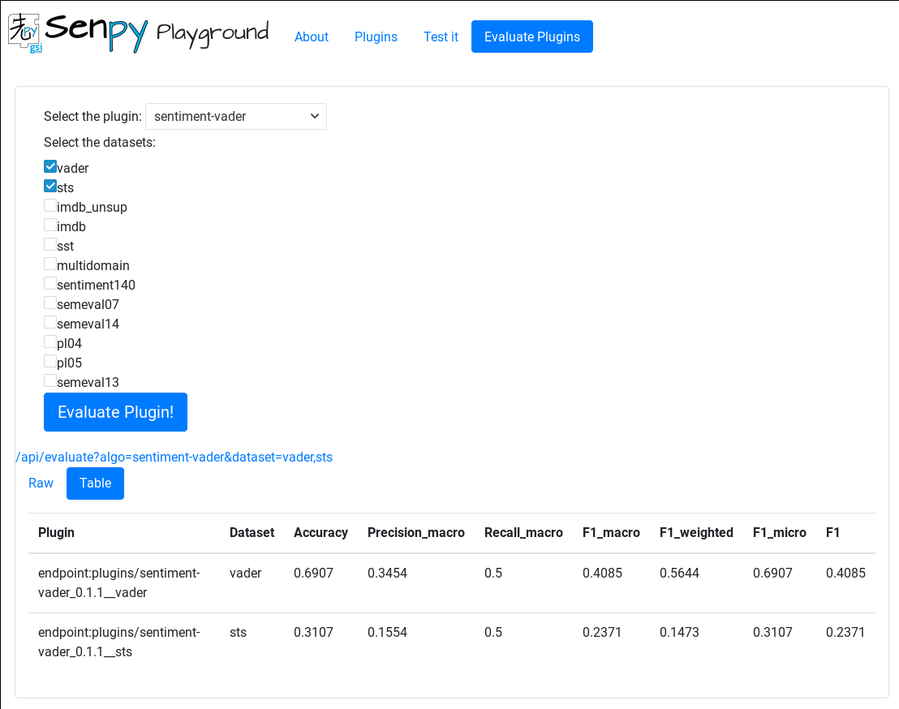

Consuming Senpy services
========================

This short tutorial will teach you how to consume services in several
ways, taking advantage of the features of the framework.

In particular, we will cover:

-  Annotating text with sentiment
-  Annotating text with emotion
-  Getting results in different formats (Turtle, XML, text…)
-  Asking for specific emotion models (automatic model conversion)
-  Listing available services in an endpoint
-  Switching to different services
-  Calling multiple services in the same request (Pipelines)

The latest version of this IPython notebook is available at:
https://github.com/gsi-upm/senpy/tree/master/docs/Quickstart.ipynb

Requirements
------------

For the sake of simplicity, this tutorial will use the demo server:
http://senpy.gsi.upm.es:

.. code:: ipython3

    endpoint = 'http://senpy.gsi.upm.es/api'

This server runs some open source plugins for sentiment and emotion
analysis.

The HTTP API of Senpy can be queried with your favourite tool. This is
just an example using curl:

.. code:: bash

   curl "http://senpy.gsi.upm.es/api/sentiment140" --data-urlencode "input=Senpy is awesome"

For simplicity, in this tutorial we will use the requests library. We
will also add a function to add syntax highlighting for the
JSON-LD/Turtle results:

.. code:: ipython3

    try:
        from IPython.display import Code
        def pretty(txt, language='json-ld'):
            return Code(txt, language=language)
    except ImportError:
        def pretty(txt, **kwargs):
            print(txt)

Once you’re familiar with Senpy, you can deploy your own instance quite
easily. e.g. using docker:

::

   docker run -ti --name 'SenpyEndpoint' -d -p 5000:5000 gsiupm/senpy

Then, feel free to change the endpoint variable to run the examples in
your own instance.

Sentiment Analysis of Text
--------------------------

To start, let us analyse the sentiment in the following sentence: *senpy
is a wonderful service*.

For now, we will use the `sentiment140 <http://www.sentiment140.com/>`__
service, through the sentiment140 plugin. We will later cover how to use
a different service.

.. code:: ipython3

    import requests
    res = requests.get(f'{endpoint}/sentiment140',
                       params={"input": "Senpy is awesome",})
    pretty(res.text)


.. raw:: html

    <style>.output_html .hll { background-color: #ffffcc }
    .output_html  { background: #f8f8f8; }
    .output_html .c { color: #408080; font-style: italic } /* Comment */
    .output_html .err { border: 1px solid #FF0000 } /* Error */
    .output_html .k { color: #008000; font-weight: bold } /* Keyword */
    .output_html .o { color: #666666 } /* Operator */
    .output_html .ch { color: #408080; font-style: italic } /* Comment.Hashbang */
    .output_html .cm { color: #408080; font-style: italic } /* Comment.Multiline */
    .output_html .cp { color: #BC7A00 } /* Comment.Preproc */
    .output_html .cpf { color: #408080; font-style: italic } /* Comment.PreprocFile */
    .output_html .c1 { color: #408080; font-style: italic } /* Comment.Single */
    .output_html .cs { color: #408080; font-style: italic } /* Comment.Special */
    .output_html .gd { color: #A00000 } /* Generic.Deleted */
    .output_html .ge { font-style: italic } /* Generic.Emph */
    .output_html .gr { color: #FF0000 } /* Generic.Error */
    .output_html .gh { color: #000080; font-weight: bold } /* Generic.Heading */
    .output_html .gi { color: #00A000 } /* Generic.Inserted */
    .output_html .go { color: #888888 } /* Generic.Output */
    .output_html .gp { color: #000080; font-weight: bold } /* Generic.Prompt */
    .output_html .gs { font-weight: bold } /* Generic.Strong */
    .output_html .gu { color: #800080; font-weight: bold } /* Generic.Subheading */
    .output_html .gt { color: #0044DD } /* Generic.Traceback */
    .output_html .kc { color: #008000; font-weight: bold } /* Keyword.Constant */
    .output_html .kd { color: #008000; font-weight: bold } /* Keyword.Declaration */
    .output_html .kn { color: #008000; font-weight: bold } /* Keyword.Namespace */
    .output_html .kp { color: #008000 } /* Keyword.Pseudo */
    .output_html .kr { color: #008000; font-weight: bold } /* Keyword.Reserved */
    .output_html .kt { color: #B00040 } /* Keyword.Type */
    .output_html .m { color: #666666 } /* Literal.Number */
    .output_html .s { color: #BA2121 } /* Literal.String */
    .output_html .na { color: #7D9029 } /* Name.Attribute */
    .output_html .nb { color: #008000 } /* Name.Builtin */
    .output_html .nc { color: #0000FF; font-weight: bold } /* Name.Class */
    .output_html .no { color: #880000 } /* Name.Constant */
    .output_html .nd { color: #AA22FF } /* Name.Decorator */
    .output_html .ni { color: #999999; font-weight: bold } /* Name.Entity */
    .output_html .ne { color: #D2413A; font-weight: bold } /* Name.Exception */
    .output_html .nf { color: #0000FF } /* Name.Function */
    .output_html .nl { color: #A0A000 } /* Name.Label */
    .output_html .nn { color: #0000FF; font-weight: bold } /* Name.Namespace */
    .output_html .nt { color: #008000; font-weight: bold } /* Name.Tag */
    .output_html .nv { color: #19177C } /* Name.Variable */
    .output_html .ow { color: #AA22FF; font-weight: bold } /* Operator.Word */
    .output_html .w { color: #bbbbbb } /* Text.Whitespace */
    .output_html .mb { color: #666666 } /* Literal.Number.Bin */
    .output_html .mf { color: #666666 } /* Literal.Number.Float */
    .output_html .mh { color: #666666 } /* Literal.Number.Hex */
    .output_html .mi { color: #666666 } /* Literal.Number.Integer */
    .output_html .mo { color: #666666 } /* Literal.Number.Oct */
    .output_html .sa { color: #BA2121 } /* Literal.String.Affix */
    .output_html .sb { color: #BA2121 } /* Literal.String.Backtick */
    .output_html .sc { color: #BA2121 } /* Literal.String.Char */
    .output_html .dl { color: #BA2121 } /* Literal.String.Delimiter */
    .output_html .sd { color: #BA2121; font-style: italic } /* Literal.String.Doc */
    .output_html .s2 { color: #BA2121 } /* Literal.String.Double */
    .output_html .se { color: #BB6622; font-weight: bold } /* Literal.String.Escape */
    .output_html .sh { color: #BA2121 } /* Literal.String.Heredoc */
    .output_html .si { color: #BB6688; font-weight: bold } /* Literal.String.Interpol */
    .output_html .sx { color: #008000 } /* Literal.String.Other */
    .output_html .sr { color: #BB6688 } /* Literal.String.Regex */
    .output_html .s1 { color: #BA2121 } /* Literal.String.Single */
    .output_html .ss { color: #19177C } /* Literal.String.Symbol */
    .output_html .bp { color: #008000 } /* Name.Builtin.Pseudo */
    .output_html .fm { color: #0000FF } /* Name.Function.Magic */
    .output_html .vc { color: #19177C } /* Name.Variable.Class */
    .output_html .vg { color: #19177C } /* Name.Variable.Global */
    .output_html .vi { color: #19177C } /* Name.Variable.Instance */
    .output_html .vm { color: #19177C } /* Name.Variable.Magic */
    .output_html .il { color: #666666 } /* Literal.Number.Integer.Long */</style><div class="highlight"><pre><span></span><span class="p">{</span>
      <span class="nd">&quot;@context&quot;</span><span class="p">:</span> <span class="s2">&quot;http://senpy.gsi.upm.es/api/contexts/YXBpL3NlbnRpbWVudDE0MD9pbnB1dD1TZW5weStpcythd2Vzb21lIw%3D%3D&quot;</span><span class="p">,</span>
      <span class="nd">&quot;@type&quot;</span><span class="p">:</span> <span class="s2">&quot;Results&quot;</span><span class="p">,</span>
      <span class="nt">&quot;entries&quot;</span><span class="p">:</span> <span class="p">[</span>
        <span class="p">{</span>
          <span class="nd">&quot;@id&quot;</span><span class="p">:</span> <span class="s2">&quot;prefix:&quot;</span><span class="p">,</span>
          <span class="nd">&quot;@type&quot;</span><span class="p">:</span> <span class="s2">&quot;Entry&quot;</span><span class="p">,</span>
          <span class="nt">&quot;marl:hasOpinion&quot;</span><span class="p">:</span> <span class="p">[</span>
            <span class="p">{</span>
              <span class="nd">&quot;@type&quot;</span><span class="p">:</span> <span class="s2">&quot;Sentiment&quot;</span><span class="p">,</span>
              <span class="nt">&quot;marl:hasPolarity&quot;</span><span class="p">:</span> <span class="s2">&quot;marl:Positive&quot;</span><span class="p">,</span>
              <span class="nt">&quot;prov:wasGeneratedBy&quot;</span><span class="p">:</span> <span class="s2">&quot;prefix:Analysis_1554364667.7955277&quot;</span>
            <span class="p">}</span>
          <span class="p">],</span>
          <span class="nt">&quot;nif:isString&quot;</span><span class="p">:</span> <span class="s2">&quot;Senpy is awesome&quot;</span><span class="p">,</span>
          <span class="nt">&quot;onyx:hasEmotionSet&quot;</span><span class="p">:</span> <span class="p">[]</span>
        <span class="p">}</span>
      <span class="p">]</span>
    <span class="p">}</span>
    </pre></div>


Senpy services always return an object of type ``senpy:Results``, with a
list of entries. You can think of an entry as a self-contained textual
context (``nif:Context`` and ``senpy:Entry``). Entries can be as short
as a sentence, or as long as a news article.

Each entry has a ``nif:isString`` property that contains the original
text of the entry, and several other properties that are provided by the
plugins.

For instance, sentiment annotations are provided through
``marl:hasOpinion``.

The annotations are semantic. We can ask Senpy for the expanded JSON-LD
output to reveal the full URIs of each property and entity:

.. code:: ipython3

    import requests
    res = requests.get(f'{endpoint}/sentiment140',
                       params={"input": "Senpy is awesome",
                               "expanded": True})
    pretty(res.text)


.. raw:: html

    <style>.output_html .hll { background-color: #ffffcc }
    .output_html  { background: #f8f8f8; }
    .output_html .c { color: #408080; font-style: italic } /* Comment */
    .output_html .err { border: 1px solid #FF0000 } /* Error */
    .output_html .k { color: #008000; font-weight: bold } /* Keyword */
    .output_html .o { color: #666666 } /* Operator */
    .output_html .ch { color: #408080; font-style: italic } /* Comment.Hashbang */
    .output_html .cm { color: #408080; font-style: italic } /* Comment.Multiline */
    .output_html .cp { color: #BC7A00 } /* Comment.Preproc */
    .output_html .cpf { color: #408080; font-style: italic } /* Comment.PreprocFile */
    .output_html .c1 { color: #408080; font-style: italic } /* Comment.Single */
    .output_html .cs { color: #408080; font-style: italic } /* Comment.Special */
    .output_html .gd { color: #A00000 } /* Generic.Deleted */
    .output_html .ge { font-style: italic } /* Generic.Emph */
    .output_html .gr { color: #FF0000 } /* Generic.Error */
    .output_html .gh { color: #000080; font-weight: bold } /* Generic.Heading */
    .output_html .gi { color: #00A000 } /* Generic.Inserted */
    .output_html .go { color: #888888 } /* Generic.Output */
    .output_html .gp { color: #000080; font-weight: bold } /* Generic.Prompt */
    .output_html .gs { font-weight: bold } /* Generic.Strong */
    .output_html .gu { color: #800080; font-weight: bold } /* Generic.Subheading */
    .output_html .gt { color: #0044DD } /* Generic.Traceback */
    .output_html .kc { color: #008000; font-weight: bold } /* Keyword.Constant */
    .output_html .kd { color: #008000; font-weight: bold } /* Keyword.Declaration */
    .output_html .kn { color: #008000; font-weight: bold } /* Keyword.Namespace */
    .output_html .kp { color: #008000 } /* Keyword.Pseudo */
    .output_html .kr { color: #008000; font-weight: bold } /* Keyword.Reserved */
    .output_html .kt { color: #B00040 } /* Keyword.Type */
    .output_html .m { color: #666666 } /* Literal.Number */
    .output_html .s { color: #BA2121 } /* Literal.String */
    .output_html .na { color: #7D9029 } /* Name.Attribute */
    .output_html .nb { color: #008000 } /* Name.Builtin */
    .output_html .nc { color: #0000FF; font-weight: bold } /* Name.Class */
    .output_html .no { color: #880000 } /* Name.Constant */
    .output_html .nd { color: #AA22FF } /* Name.Decorator */
    .output_html .ni { color: #999999; font-weight: bold } /* Name.Entity */
    .output_html .ne { color: #D2413A; font-weight: bold } /* Name.Exception */
    .output_html .nf { color: #0000FF } /* Name.Function */
    .output_html .nl { color: #A0A000 } /* Name.Label */
    .output_html .nn { color: #0000FF; font-weight: bold } /* Name.Namespace */
    .output_html .nt { color: #008000; font-weight: bold } /* Name.Tag */
    .output_html .nv { color: #19177C } /* Name.Variable */
    .output_html .ow { color: #AA22FF; font-weight: bold } /* Operator.Word */
    .output_html .w { color: #bbbbbb } /* Text.Whitespace */
    .output_html .mb { color: #666666 } /* Literal.Number.Bin */
    .output_html .mf { color: #666666 } /* Literal.Number.Float */
    .output_html .mh { color: #666666 } /* Literal.Number.Hex */
    .output_html .mi { color: #666666 } /* Literal.Number.Integer */
    .output_html .mo { color: #666666 } /* Literal.Number.Oct */
    .output_html .sa { color: #BA2121 } /* Literal.String.Affix */
    .output_html .sb { color: #BA2121 } /* Literal.String.Backtick */
    .output_html .sc { color: #BA2121 } /* Literal.String.Char */
    .output_html .dl { color: #BA2121 } /* Literal.String.Delimiter */
    .output_html .sd { color: #BA2121; font-style: italic } /* Literal.String.Doc */
    .output_html .s2 { color: #BA2121 } /* Literal.String.Double */
    .output_html .se { color: #BB6622; font-weight: bold } /* Literal.String.Escape */
    .output_html .sh { color: #BA2121 } /* Literal.String.Heredoc */
    .output_html .si { color: #BB6688; font-weight: bold } /* Literal.String.Interpol */
    .output_html .sx { color: #008000 } /* Literal.String.Other */
    .output_html .sr { color: #BB6688 } /* Literal.String.Regex */
    .output_html .s1 { color: #BA2121 } /* Literal.String.Single */
    .output_html .ss { color: #19177C } /* Literal.String.Symbol */
    .output_html .bp { color: #008000 } /* Name.Builtin.Pseudo */
    .output_html .fm { color: #0000FF } /* Name.Function.Magic */
    .output_html .vc { color: #19177C } /* Name.Variable.Class */
    .output_html .vg { color: #19177C } /* Name.Variable.Global */
    .output_html .vi { color: #19177C } /* Name.Variable.Instance */
    .output_html .vm { color: #19177C } /* Name.Variable.Magic */
    .output_html .il { color: #666666 } /* Literal.Number.Integer.Long */</style><div class="highlight"><pre><span></span><span class="p">{</span>
      <span class="nd">&quot;@context&quot;</span><span class="p">:</span> <span class="s2">&quot;http://senpy.gsi.upm.es/api/contexts/YXBpL3NlbnRpbWVudDE0MD9pbnB1dD1TZW5weStpcythd2Vzb21lJmV4cGFuZGVkPVRydWUj&quot;</span><span class="p">,</span>
      <span class="nd">&quot;@type&quot;</span><span class="p">:</span> <span class="p">[</span>
        <span class="s2">&quot;http://www.gsi.upm.es/onto/senpy/ns#Results&quot;</span>
      <span class="p">],</span>
      <span class="nt">&quot;http://www.w3.org/ns/prov#used&quot;</span><span class="p">:</span> <span class="p">[</span>
        <span class="p">{</span>
          <span class="nd">&quot;@id&quot;</span><span class="p">:</span> <span class="s2">&quot;http://senpy.invalid/&quot;</span><span class="p">,</span>
          <span class="nd">&quot;@type&quot;</span><span class="p">:</span> <span class="p">[</span>
            <span class="s2">&quot;http://www.gsi.upm.es/onto/senpy/ns#Entry&quot;</span>
          <span class="p">],</span>
          <span class="nt">&quot;http://persistence.uni-leipzig.org/nlp2rdf/ontologies/nif-core#isString&quot;</span><span class="p">:</span> <span class="p">[</span>
            <span class="p">{</span>
              <span class="nd">&quot;@value&quot;</span><span class="p">:</span> <span class="s2">&quot;Senpy is awesome&quot;</span>
            <span class="p">}</span>
          <span class="p">],</span>
          <span class="nt">&quot;http://www.gsi.dit.upm.es/ontologies/marl/ns#hasOpinion&quot;</span><span class="p">:</span> <span class="p">[</span>
            <span class="p">{</span>
              <span class="nd">&quot;@type&quot;</span><span class="p">:</span> <span class="p">[</span>
                <span class="s2">&quot;http://www.gsi.upm.es/onto/senpy/ns#Sentiment&quot;</span>
              <span class="p">],</span>
              <span class="nt">&quot;http://www.gsi.dit.upm.es/ontologies/marl/ns#hasPolarity&quot;</span><span class="p">:</span> <span class="p">[</span>
                <span class="p">{</span>
                  <span class="nd">&quot;@value&quot;</span><span class="p">:</span> <span class="s2">&quot;marl:Positive&quot;</span>
                <span class="p">}</span>
              <span class="p">],</span>
              <span class="nt">&quot;http://www.w3.org/ns/prov#wasGeneratedBy&quot;</span><span class="p">:</span> <span class="p">[</span>
                <span class="p">{</span>
                  <span class="nd">&quot;@id&quot;</span><span class="p">:</span> <span class="s2">&quot;http://senpy.invalid/Analysis_1554364668.1011338&quot;</span>
                <span class="p">}</span>
              <span class="p">]</span>
            <span class="p">}</span>
          <span class="p">],</span>
          <span class="nt">&quot;http://www.gsi.dit.upm.es/ontologies/onyx/ns#hasEmotionSet&quot;</span><span class="p">:</span> <span class="p">[]</span>
        <span class="p">}</span>
      <span class="p">]</span>
    <span class="p">}</span>
    </pre></div>


.. code:: ipython3

    pretty(res.text)


.. raw:: html

    <style>.output_html .hll { background-color: #ffffcc }
    .output_html  { background: #f8f8f8; }
    .output_html .c { color: #408080; font-style: italic } /* Comment */
    .output_html .err { border: 1px solid #FF0000 } /* Error */
    .output_html .k { color: #008000; font-weight: bold } /* Keyword */
    .output_html .o { color: #666666 } /* Operator */
    .output_html .ch { color: #408080; font-style: italic } /* Comment.Hashbang */
    .output_html .cm { color: #408080; font-style: italic } /* Comment.Multiline */
    .output_html .cp { color: #BC7A00 } /* Comment.Preproc */
    .output_html .cpf { color: #408080; font-style: italic } /* Comment.PreprocFile */
    .output_html .c1 { color: #408080; font-style: italic } /* Comment.Single */
    .output_html .cs { color: #408080; font-style: italic } /* Comment.Special */
    .output_html .gd { color: #A00000 } /* Generic.Deleted */
    .output_html .ge { font-style: italic } /* Generic.Emph */
    .output_html .gr { color: #FF0000 } /* Generic.Error */
    .output_html .gh { color: #000080; font-weight: bold } /* Generic.Heading */
    .output_html .gi { color: #00A000 } /* Generic.Inserted */
    .output_html .go { color: #888888 } /* Generic.Output */
    .output_html .gp { color: #000080; font-weight: bold } /* Generic.Prompt */
    .output_html .gs { font-weight: bold } /* Generic.Strong */
    .output_html .gu { color: #800080; font-weight: bold } /* Generic.Subheading */
    .output_html .gt { color: #0044DD } /* Generic.Traceback */
    .output_html .kc { color: #008000; font-weight: bold } /* Keyword.Constant */
    .output_html .kd { color: #008000; font-weight: bold } /* Keyword.Declaration */
    .output_html .kn { color: #008000; font-weight: bold } /* Keyword.Namespace */
    .output_html .kp { color: #008000 } /* Keyword.Pseudo */
    .output_html .kr { color: #008000; font-weight: bold } /* Keyword.Reserved */
    .output_html .kt { color: #B00040 } /* Keyword.Type */
    .output_html .m { color: #666666 } /* Literal.Number */
    .output_html .s { color: #BA2121 } /* Literal.String */
    .output_html .na { color: #7D9029 } /* Name.Attribute */
    .output_html .nb { color: #008000 } /* Name.Builtin */
    .output_html .nc { color: #0000FF; font-weight: bold } /* Name.Class */
    .output_html .no { color: #880000 } /* Name.Constant */
    .output_html .nd { color: #AA22FF } /* Name.Decorator */
    .output_html .ni { color: #999999; font-weight: bold } /* Name.Entity */
    .output_html .ne { color: #D2413A; font-weight: bold } /* Name.Exception */
    .output_html .nf { color: #0000FF } /* Name.Function */
    .output_html .nl { color: #A0A000 } /* Name.Label */
    .output_html .nn { color: #0000FF; font-weight: bold } /* Name.Namespace */
    .output_html .nt { color: #008000; font-weight: bold } /* Name.Tag */
    .output_html .nv { color: #19177C } /* Name.Variable */
    .output_html .ow { color: #AA22FF; font-weight: bold } /* Operator.Word */
    .output_html .w { color: #bbbbbb } /* Text.Whitespace */
    .output_html .mb { color: #666666 } /* Literal.Number.Bin */
    .output_html .mf { color: #666666 } /* Literal.Number.Float */
    .output_html .mh { color: #666666 } /* Literal.Number.Hex */
    .output_html .mi { color: #666666 } /* Literal.Number.Integer */
    .output_html .mo { color: #666666 } /* Literal.Number.Oct */
    .output_html .sa { color: #BA2121 } /* Literal.String.Affix */
    .output_html .sb { color: #BA2121 } /* Literal.String.Backtick */
    .output_html .sc { color: #BA2121 } /* Literal.String.Char */
    .output_html .dl { color: #BA2121 } /* Literal.String.Delimiter */
    .output_html .sd { color: #BA2121; font-style: italic } /* Literal.String.Doc */
    .output_html .s2 { color: #BA2121 } /* Literal.String.Double */
    .output_html .se { color: #BB6622; font-weight: bold } /* Literal.String.Escape */
    .output_html .sh { color: #BA2121 } /* Literal.String.Heredoc */
    .output_html .si { color: #BB6688; font-weight: bold } /* Literal.String.Interpol */
    .output_html .sx { color: #008000 } /* Literal.String.Other */
    .output_html .sr { color: #BB6688 } /* Literal.String.Regex */
    .output_html .s1 { color: #BA2121 } /* Literal.String.Single */
    .output_html .ss { color: #19177C } /* Literal.String.Symbol */
    .output_html .bp { color: #008000 } /* Name.Builtin.Pseudo */
    .output_html .fm { color: #0000FF } /* Name.Function.Magic */
    .output_html .vc { color: #19177C } /* Name.Variable.Class */
    .output_html .vg { color: #19177C } /* Name.Variable.Global */
    .output_html .vi { color: #19177C } /* Name.Variable.Instance */
    .output_html .vm { color: #19177C } /* Name.Variable.Magic */
    .output_html .il { color: #666666 } /* Literal.Number.Integer.Long */</style><div class="highlight"><pre><span></span><span class="p">{</span>
      <span class="nd">&quot;@context&quot;</span><span class="p">:</span> <span class="s2">&quot;http://senpy.gsi.upm.es/api/contexts/YXBpL3NlbnRpbWVudDE0MD9pbnB1dD1TZW5weStpcythd2Vzb21lJmV4cGFuZGVkPVRydWUj&quot;</span><span class="p">,</span>
      <span class="nd">&quot;@type&quot;</span><span class="p">:</span> <span class="p">[</span>
        <span class="s2">&quot;http://www.gsi.upm.es/onto/senpy/ns#Results&quot;</span>
      <span class="p">],</span>
      <span class="nt">&quot;http://www.w3.org/ns/prov#used&quot;</span><span class="p">:</span> <span class="p">[</span>
        <span class="p">{</span>
          <span class="nd">&quot;@id&quot;</span><span class="p">:</span> <span class="s2">&quot;http://senpy.invalid/&quot;</span><span class="p">,</span>
          <span class="nd">&quot;@type&quot;</span><span class="p">:</span> <span class="p">[</span>
            <span class="s2">&quot;http://www.gsi.upm.es/onto/senpy/ns#Entry&quot;</span>
          <span class="p">],</span>
          <span class="nt">&quot;http://persistence.uni-leipzig.org/nlp2rdf/ontologies/nif-core#isString&quot;</span><span class="p">:</span> <span class="p">[</span>
            <span class="p">{</span>
              <span class="nd">&quot;@value&quot;</span><span class="p">:</span> <span class="s2">&quot;Senpy is awesome&quot;</span>
            <span class="p">}</span>
          <span class="p">],</span>
          <span class="nt">&quot;http://www.gsi.dit.upm.es/ontologies/marl/ns#hasOpinion&quot;</span><span class="p">:</span> <span class="p">[</span>
            <span class="p">{</span>
              <span class="nd">&quot;@type&quot;</span><span class="p">:</span> <span class="p">[</span>
                <span class="s2">&quot;http://www.gsi.upm.es/onto/senpy/ns#Sentiment&quot;</span>
              <span class="p">],</span>
              <span class="nt">&quot;http://www.gsi.dit.upm.es/ontologies/marl/ns#hasPolarity&quot;</span><span class="p">:</span> <span class="p">[</span>
                <span class="p">{</span>
                  <span class="nd">&quot;@value&quot;</span><span class="p">:</span> <span class="s2">&quot;marl:Positive&quot;</span>
                <span class="p">}</span>
              <span class="p">],</span>
              <span class="nt">&quot;http://www.w3.org/ns/prov#wasGeneratedBy&quot;</span><span class="p">:</span> <span class="p">[</span>
                <span class="p">{</span>
                  <span class="nd">&quot;@id&quot;</span><span class="p">:</span> <span class="s2">&quot;http://senpy.invalid/Analysis_1554364668.1011338&quot;</span>
                <span class="p">}</span>
              <span class="p">]</span>
            <span class="p">}</span>
          <span class="p">],</span>
          <span class="nt">&quot;http://www.gsi.dit.upm.es/ontologies/onyx/ns#hasEmotionSet&quot;</span><span class="p">:</span> <span class="p">[]</span>
        <span class="p">}</span>
      <span class="p">]</span>
    <span class="p">}</span>
    </pre></div>


Other output formats
--------------------

Senpy supports several semantic formats, like turtle and xml-RDF. You
can select the format of the output with the ``outformat`` parameter:

.. code:: ipython3

    res = requests.get(f'{endpoint}/sentiment140',
                       params={"input": "Senpy is the best framework for semantic sentiment analysis, and very easy to use",
                                "outformat": "turtle"})
    pretty(res.text, language='turtle')


.. raw:: html

    <style>.output_html .hll { background-color: #ffffcc }
    .output_html  { background: #f8f8f8; }
    .output_html .c { color: #408080; font-style: italic } /* Comment */
    .output_html .err { border: 1px solid #FF0000 } /* Error */
    .output_html .k { color: #008000; font-weight: bold } /* Keyword */
    .output_html .o { color: #666666 } /* Operator */
    .output_html .ch { color: #408080; font-style: italic } /* Comment.Hashbang */
    .output_html .cm { color: #408080; font-style: italic } /* Comment.Multiline */
    .output_html .cp { color: #BC7A00 } /* Comment.Preproc */
    .output_html .cpf { color: #408080; font-style: italic } /* Comment.PreprocFile */
    .output_html .c1 { color: #408080; font-style: italic } /* Comment.Single */
    .output_html .cs { color: #408080; font-style: italic } /* Comment.Special */
    .output_html .gd { color: #A00000 } /* Generic.Deleted */
    .output_html .ge { font-style: italic } /* Generic.Emph */
    .output_html .gr { color: #FF0000 } /* Generic.Error */
    .output_html .gh { color: #000080; font-weight: bold } /* Generic.Heading */
    .output_html .gi { color: #00A000 } /* Generic.Inserted */
    .output_html .go { color: #888888 } /* Generic.Output */
    .output_html .gp { color: #000080; font-weight: bold } /* Generic.Prompt */
    .output_html .gs { font-weight: bold } /* Generic.Strong */
    .output_html .gu { color: #800080; font-weight: bold } /* Generic.Subheading */
    .output_html .gt { color: #0044DD } /* Generic.Traceback */
    .output_html .kc { color: #008000; font-weight: bold } /* Keyword.Constant */
    .output_html .kd { color: #008000; font-weight: bold } /* Keyword.Declaration */
    .output_html .kn { color: #008000; font-weight: bold } /* Keyword.Namespace */
    .output_html .kp { color: #008000 } /* Keyword.Pseudo */
    .output_html .kr { color: #008000; font-weight: bold } /* Keyword.Reserved */
    .output_html .kt { color: #B00040 } /* Keyword.Type */
    .output_html .m { color: #666666 } /* Literal.Number */
    .output_html .s { color: #BA2121 } /* Literal.String */
    .output_html .na { color: #7D9029 } /* Name.Attribute */
    .output_html .nb { color: #008000 } /* Name.Builtin */
    .output_html .nc { color: #0000FF; font-weight: bold } /* Name.Class */
    .output_html .no { color: #880000 } /* Name.Constant */
    .output_html .nd { color: #AA22FF } /* Name.Decorator */
    .output_html .ni { color: #999999; font-weight: bold } /* Name.Entity */
    .output_html .ne { color: #D2413A; font-weight: bold } /* Name.Exception */
    .output_html .nf { color: #0000FF } /* Name.Function */
    .output_html .nl { color: #A0A000 } /* Name.Label */
    .output_html .nn { color: #0000FF; font-weight: bold } /* Name.Namespace */
    .output_html .nt { color: #008000; font-weight: bold } /* Name.Tag */
    .output_html .nv { color: #19177C } /* Name.Variable */
    .output_html .ow { color: #AA22FF; font-weight: bold } /* Operator.Word */
    .output_html .w { color: #bbbbbb } /* Text.Whitespace */
    .output_html .mb { color: #666666 } /* Literal.Number.Bin */
    .output_html .mf { color: #666666 } /* Literal.Number.Float */
    .output_html .mh { color: #666666 } /* Literal.Number.Hex */
    .output_html .mi { color: #666666 } /* Literal.Number.Integer */
    .output_html .mo { color: #666666 } /* Literal.Number.Oct */
    .output_html .sa { color: #BA2121 } /* Literal.String.Affix */
    .output_html .sb { color: #BA2121 } /* Literal.String.Backtick */
    .output_html .sc { color: #BA2121 } /* Literal.String.Char */
    .output_html .dl { color: #BA2121 } /* Literal.String.Delimiter */
    .output_html .sd { color: #BA2121; font-style: italic } /* Literal.String.Doc */
    .output_html .s2 { color: #BA2121 } /* Literal.String.Double */
    .output_html .se { color: #BB6622; font-weight: bold } /* Literal.String.Escape */
    .output_html .sh { color: #BA2121 } /* Literal.String.Heredoc */
    .output_html .si { color: #BB6688; font-weight: bold } /* Literal.String.Interpol */
    .output_html .sx { color: #008000 } /* Literal.String.Other */
    .output_html .sr { color: #BB6688 } /* Literal.String.Regex */
    .output_html .s1 { color: #BA2121 } /* Literal.String.Single */
    .output_html .ss { color: #19177C } /* Literal.String.Symbol */
    .output_html .bp { color: #008000 } /* Name.Builtin.Pseudo */
    .output_html .fm { color: #0000FF } /* Name.Function.Magic */
    .output_html .vc { color: #19177C } /* Name.Variable.Class */
    .output_html .vg { color: #19177C } /* Name.Variable.Global */
    .output_html .vi { color: #19177C } /* Name.Variable.Instance */
    .output_html .vm { color: #19177C } /* Name.Variable.Magic */
    .output_html .il { color: #666666 } /* Literal.Number.Integer.Long */</style><div class="highlight"><pre><span></span><span class="k">@prefix</span><span class="w"> </span><span class="nn">:</span><span class="w"> </span><span class="nv">&lt;http://www.gsi.upm.es/onto/senpy/ns#&gt;</span><span class="w"> </span><span class="p">.</span><span class="w"></span>
    <span class="k">@prefix</span><span class="w"> </span><span class="nn">dc:</span><span class="w"> </span><span class="nv">&lt;http://dublincore.org/2012/06/14/dcelements#&gt;</span><span class="w"> </span><span class="p">.</span><span class="w"></span>
    <span class="k">@prefix</span><span class="w"> </span><span class="nn">emoml:</span><span class="w"> </span><span class="nv">&lt;http://www.gsi.dit.upm.es/ontologies/onyx/vocabularies/emotionml/ns#&gt;</span><span class="w"> </span><span class="p">.</span><span class="w"></span>
    <span class="k">@prefix</span><span class="w"> </span><span class="nn">endpoint:</span><span class="w"> </span><span class="nv">&lt;http://senpy.gsi.upm.es/api/&gt;</span><span class="w"> </span><span class="p">.</span><span class="w"></span>
    <span class="k">@prefix</span><span class="w"> </span><span class="nn">fam:</span><span class="w"> </span><span class="nv">&lt;http://vocab.fusepool.info/fam#&gt;</span><span class="w"> </span><span class="p">.</span><span class="w"></span>
    <span class="k">@prefix</span><span class="w"> </span><span class="nn">marl:</span><span class="w"> </span><span class="nv">&lt;http://www.gsi.dit.upm.es/ontologies/marl/ns#&gt;</span><span class="w"> </span><span class="p">.</span><span class="w"></span>
    <span class="k">@prefix</span><span class="w"> </span><span class="nn">nif:</span><span class="w"> </span><span class="nv">&lt;http://persistence.uni-leipzig.org/nlp2rdf/ontologies/nif-core#&gt;</span><span class="w"> </span><span class="p">.</span><span class="w"></span>
    <span class="k">@prefix</span><span class="w"> </span><span class="nn">onyx:</span><span class="w"> </span><span class="nv">&lt;http://www.gsi.dit.upm.es/ontologies/onyx/ns#&gt;</span><span class="w"> </span><span class="p">.</span><span class="w"></span>
    <span class="k">@prefix</span><span class="w"> </span><span class="nn">prefix:</span><span class="w"> </span><span class="nv">&lt;http://senpy.invalid/&gt;</span><span class="w"> </span><span class="p">.</span><span class="w"></span>
    <span class="k">@prefix</span><span class="w"> </span><span class="nn">prov:</span><span class="w"> </span><span class="nv">&lt;http://www.w3.org/ns/prov#&gt;</span><span class="w"> </span><span class="p">.</span><span class="w"></span>
    <span class="k">@prefix</span><span class="w"> </span><span class="nn">rdf:</span><span class="w"> </span><span class="nv">&lt;http://www.w3.org/1999/02/22-rdf-syntax-ns#&gt;</span><span class="w"> </span><span class="p">.</span><span class="w"></span>
    <span class="k">@prefix</span><span class="w"> </span><span class="nn">rdfs:</span><span class="w"> </span><span class="nv">&lt;http://www.w3.org/2000/01/rdf-schema#&gt;</span><span class="w"> </span><span class="p">.</span><span class="w"></span>
    <span class="k">@prefix</span><span class="w"> </span><span class="nn">senpy:</span><span class="w"> </span><span class="nv">&lt;http://www.gsi.upm.es/onto/senpy/ns#&gt;</span><span class="w"> </span><span class="p">.</span><span class="w"></span>
    <span class="k">@prefix</span><span class="w"> </span><span class="nn">wna:</span><span class="w"> </span><span class="nv">&lt;http://www.gsi.dit.upm.es/ontologies/wnaffect/ns#&gt;</span><span class="w"> </span><span class="p">.</span><span class="w"></span>
    <span class="k">@prefix</span><span class="w"> </span><span class="nn">xml:</span><span class="w"> </span><span class="nv">&lt;http://www.w3.org/XML/1998/namespace&gt;</span><span class="w"> </span><span class="p">.</span><span class="w"></span>
    <span class="k">@prefix</span><span class="w"> </span><span class="nn">xsd:</span><span class="w"> </span><span class="nv">&lt;http://www.w3.org/2001/XMLSchema#&gt;</span><span class="w"> </span><span class="p">.</span><span class="w"></span>
    
    <span class="err">prefix</span><span class="p">:</span><span class="w"> </span><span class="kt">a</span><span class="w"> </span><span class="nn">senpy:</span><span class="nt">Entry</span><span class="w"> </span><span class="p">;</span><span class="w"></span>
    <span class="w">    </span><span class="nn">nif:</span><span class="nt">isString</span><span class="w"> </span><span class="s">&quot;Senpy is the best framework for semantic sentiment analysis, and very easy to use&quot;</span><span class="w"> </span><span class="p">;</span><span class="w"></span>
    <span class="w">    </span><span class="nn">marl:</span><span class="nt">hasOpinion</span><span class="w"> </span><span class="p">[</span><span class="w"> </span><span class="kt">a</span><span class="w"> </span><span class="nn">senpy:</span><span class="nt">Sentiment</span><span class="w"> </span><span class="p">;</span><span class="w"></span>
    <span class="w">            </span><span class="nn">marl:</span><span class="nt">hasPolarity</span><span class="w"> </span><span class="s">&quot;marl:Positive&quot;</span><span class="w"> </span><span class="p">;</span><span class="w"></span>
    <span class="w">            </span><span class="nn">prov:</span><span class="nt">wasGeneratedBy</span><span class="w"> </span><span class="nn">prefix:</span><span class="nt">Analysis_1554364668</span><span class="mf">.5153766</span><span class="w"> </span><span class="p">]</span><span class="w"> </span><span class="p">.</span><span class="w"></span>
    
    <span class="p">[]</span><span class="w"> </span><span class="kt">a</span><span class="w"> </span><span class="nn">senpy:</span><span class="nt">Results</span><span class="w"> </span><span class="p">;</span><span class="w"></span>
    <span class="w">    </span><span class="nn">prov:</span><span class="nt">used</span><span class="w"> </span><span class="err">prefix</span><span class="p">:</span><span class="w"> </span><span class="p">.</span><span class="w"></span>
    </pre></div>


Selecting fields from the output
--------------------------------

The full output in the previous sections is very useful because it is
semantically annotated. However, it is also quite verbose if we only
want to label a piece of text, or get a polarity value.

For such simple cases, the API has a special ``fields`` method you can
use to get a specific field from the results, and even transform the
results. Senpy uses jmespath under the hood, which has its own notation.

To illustrate this, let us get only the text (``nif:isString``) from
each entry:

.. code:: ipython3

    res = requests.get(f'{endpoint}/sentiment140',
                       params={"input": "Senpy is a wonderful service",
                                "fields": 'entries[]."nif:isString"'})
    print(res.text)


.. parsed-literal::

    ["Senpy is a wonderful service"]


Or we could get both the text and the polarity of the text (assuming
there is only one opinion per entry) with a slightly more complicated
query:

.. code:: ipython3

    res = requests.get(f'{endpoint}/sentiment140',
                       params={"input": "Senpy is a service. Wonderful service.",
                               "delimiter": "sentence",
                               "fields": 'entries[0].["nif:isString", "marl:hasOpinion"[0]."marl:hasPolarity"]'})
    print(res.text)


.. parsed-literal::

    ["Senpy is a service. Wonderful service.", "marl:Neutral"]


jmespath is rather extensive for this tutorial. We will cover only the
most simple cases, so you do not need to learn much about the notation.

For more complicated transformations, check out
`jmespath <http://jmespath.org>`__. In addition to a fairly complete
documentation, they have a live environment you can use to test your
queries.

Emotion analysis
----------------

Senpy uses the ``onyx`` vocabulary to represent emotions, which
incorporates the notion of ``EmotionSet``\ ’s, an emotion that is
composed of several emotions. In a nutshell, an ``Entry`` is linked to
one or more ``EmotionSet``, which in turn is made up of one or more
``Emotion``.

Let’s illustrate it with an example, using the ``emotion-depechemood``
plugin.

.. code:: ipython3

    res = requests.get(f'{endpoint}/emotion-depechemood',
                       params={"input": "Senpy is a wonderful that service"})
    pretty(res.text)


.. raw:: html

    <style>.output_html .hll { background-color: #ffffcc }
    .output_html  { background: #f8f8f8; }
    .output_html .c { color: #408080; font-style: italic } /* Comment */
    .output_html .err { border: 1px solid #FF0000 } /* Error */
    .output_html .k { color: #008000; font-weight: bold } /* Keyword */
    .output_html .o { color: #666666 } /* Operator */
    .output_html .ch { color: #408080; font-style: italic } /* Comment.Hashbang */
    .output_html .cm { color: #408080; font-style: italic } /* Comment.Multiline */
    .output_html .cp { color: #BC7A00 } /* Comment.Preproc */
    .output_html .cpf { color: #408080; font-style: italic } /* Comment.PreprocFile */
    .output_html .c1 { color: #408080; font-style: italic } /* Comment.Single */
    .output_html .cs { color: #408080; font-style: italic } /* Comment.Special */
    .output_html .gd { color: #A00000 } /* Generic.Deleted */
    .output_html .ge { font-style: italic } /* Generic.Emph */
    .output_html .gr { color: #FF0000 } /* Generic.Error */
    .output_html .gh { color: #000080; font-weight: bold } /* Generic.Heading */
    .output_html .gi { color: #00A000 } /* Generic.Inserted */
    .output_html .go { color: #888888 } /* Generic.Output */
    .output_html .gp { color: #000080; font-weight: bold } /* Generic.Prompt */
    .output_html .gs { font-weight: bold } /* Generic.Strong */
    .output_html .gu { color: #800080; font-weight: bold } /* Generic.Subheading */
    .output_html .gt { color: #0044DD } /* Generic.Traceback */
    .output_html .kc { color: #008000; font-weight: bold } /* Keyword.Constant */
    .output_html .kd { color: #008000; font-weight: bold } /* Keyword.Declaration */
    .output_html .kn { color: #008000; font-weight: bold } /* Keyword.Namespace */
    .output_html .kp { color: #008000 } /* Keyword.Pseudo */
    .output_html .kr { color: #008000; font-weight: bold } /* Keyword.Reserved */
    .output_html .kt { color: #B00040 } /* Keyword.Type */
    .output_html .m { color: #666666 } /* Literal.Number */
    .output_html .s { color: #BA2121 } /* Literal.String */
    .output_html .na { color: #7D9029 } /* Name.Attribute */
    .output_html .nb { color: #008000 } /* Name.Builtin */
    .output_html .nc { color: #0000FF; font-weight: bold } /* Name.Class */
    .output_html .no { color: #880000 } /* Name.Constant */
    .output_html .nd { color: #AA22FF } /* Name.Decorator */
    .output_html .ni { color: #999999; font-weight: bold } /* Name.Entity */
    .output_html .ne { color: #D2413A; font-weight: bold } /* Name.Exception */
    .output_html .nf { color: #0000FF } /* Name.Function */
    .output_html .nl { color: #A0A000 } /* Name.Label */
    .output_html .nn { color: #0000FF; font-weight: bold } /* Name.Namespace */
    .output_html .nt { color: #008000; font-weight: bold } /* Name.Tag */
    .output_html .nv { color: #19177C } /* Name.Variable */
    .output_html .ow { color: #AA22FF; font-weight: bold } /* Operator.Word */
    .output_html .w { color: #bbbbbb } /* Text.Whitespace */
    .output_html .mb { color: #666666 } /* Literal.Number.Bin */
    .output_html .mf { color: #666666 } /* Literal.Number.Float */
    .output_html .mh { color: #666666 } /* Literal.Number.Hex */
    .output_html .mi { color: #666666 } /* Literal.Number.Integer */
    .output_html .mo { color: #666666 } /* Literal.Number.Oct */
    .output_html .sa { color: #BA2121 } /* Literal.String.Affix */
    .output_html .sb { color: #BA2121 } /* Literal.String.Backtick */
    .output_html .sc { color: #BA2121 } /* Literal.String.Char */
    .output_html .dl { color: #BA2121 } /* Literal.String.Delimiter */
    .output_html .sd { color: #BA2121; font-style: italic } /* Literal.String.Doc */
    .output_html .s2 { color: #BA2121 } /* Literal.String.Double */
    .output_html .se { color: #BB6622; font-weight: bold } /* Literal.String.Escape */
    .output_html .sh { color: #BA2121 } /* Literal.String.Heredoc */
    .output_html .si { color: #BB6688; font-weight: bold } /* Literal.String.Interpol */
    .output_html .sx { color: #008000 } /* Literal.String.Other */
    .output_html .sr { color: #BB6688 } /* Literal.String.Regex */
    .output_html .s1 { color: #BA2121 } /* Literal.String.Single */
    .output_html .ss { color: #19177C } /* Literal.String.Symbol */
    .output_html .bp { color: #008000 } /* Name.Builtin.Pseudo */
    .output_html .fm { color: #0000FF } /* Name.Function.Magic */
    .output_html .vc { color: #19177C } /* Name.Variable.Class */
    .output_html .vg { color: #19177C } /* Name.Variable.Global */
    .output_html .vi { color: #19177C } /* Name.Variable.Instance */
    .output_html .vm { color: #19177C } /* Name.Variable.Magic */
    .output_html .il { color: #666666 } /* Literal.Number.Integer.Long */</style><div class="highlight"><pre><span></span><span class="p">{</span>
      <span class="nd">&quot;@context&quot;</span><span class="p">:</span> <span class="s2">&quot;http://senpy.gsi.upm.es/api/contexts/YXBpL2Vtb3Rpb24tZGVwZWNoZW1vb2Q_aW5wdXQ9U2VucHkraXMrYSt3b25kZXJmdWwrdGhhdCtzZXJ2aWNlIw%3D%3D&quot;</span><span class="p">,</span>
      <span class="nd">&quot;@type&quot;</span><span class="p">:</span> <span class="s2">&quot;Results&quot;</span><span class="p">,</span>
      <span class="nt">&quot;entries&quot;</span><span class="p">:</span> <span class="p">[</span>
        <span class="p">{</span>
          <span class="nd">&quot;@id&quot;</span><span class="p">:</span> <span class="s2">&quot;prefix:&quot;</span><span class="p">,</span>
          <span class="nd">&quot;@type&quot;</span><span class="p">:</span> <span class="s2">&quot;Entry&quot;</span><span class="p">,</span>
          <span class="nt">&quot;marl:hasOpinion&quot;</span><span class="p">:</span> <span class="p">[],</span>
          <span class="nt">&quot;nif:isString&quot;</span><span class="p">:</span> <span class="s2">&quot;Senpy is a wonderful that service&quot;</span><span class="p">,</span>
          <span class="nt">&quot;onyx:hasEmotionSet&quot;</span><span class="p">:</span> <span class="p">[</span>
            <span class="p">{</span>
              <span class="nd">&quot;@type&quot;</span><span class="p">:</span> <span class="s2">&quot;EmotionSet&quot;</span><span class="p">,</span>
              <span class="nt">&quot;onyx:hasEmotion&quot;</span><span class="p">:</span> <span class="p">[</span>
                <span class="p">{</span>
                  <span class="nd">&quot;@type&quot;</span><span class="p">:</span> <span class="s2">&quot;Emotion&quot;</span><span class="p">,</span>
                  <span class="nt">&quot;onyx:hasEmotionCategory&quot;</span><span class="p">:</span> <span class="s2">&quot;wna:negative-fear&quot;</span><span class="p">,</span>
                  <span class="nt">&quot;onyx:hasEmotionIntensity&quot;</span><span class="p">:</span> <span class="mf">0.06258366271018097</span>
                <span class="p">},</span>
                <span class="p">{</span>
                  <span class="nd">&quot;@type&quot;</span><span class="p">:</span> <span class="s2">&quot;Emotion&quot;</span><span class="p">,</span>
                  <span class="nt">&quot;onyx:hasEmotionCategory&quot;</span><span class="p">:</span> <span class="s2">&quot;wna:amusement&quot;</span><span class="p">,</span>
                  <span class="nt">&quot;onyx:hasEmotionIntensity&quot;</span><span class="p">:</span> <span class="mf">0.15784834034155437</span>
                <span class="p">},</span>
                <span class="p">{</span>
                  <span class="nd">&quot;@type&quot;</span><span class="p">:</span> <span class="s2">&quot;Emotion&quot;</span><span class="p">,</span>
                  <span class="nt">&quot;onyx:hasEmotionCategory&quot;</span><span class="p">:</span> <span class="s2">&quot;wna:anger&quot;</span><span class="p">,</span>
                  <span class="nt">&quot;onyx:hasEmotionIntensity&quot;</span><span class="p">:</span> <span class="mf">0.08728815135373413</span>
                <span class="p">},</span>
                <span class="p">{</span>
                  <span class="nd">&quot;@type&quot;</span><span class="p">:</span> <span class="s2">&quot;Emotion&quot;</span><span class="p">,</span>
                  <span class="nt">&quot;onyx:hasEmotionCategory&quot;</span><span class="p">:</span> <span class="s2">&quot;wna:annoyance&quot;</span><span class="p">,</span>
                  <span class="nt">&quot;onyx:hasEmotionIntensity&quot;</span><span class="p">:</span> <span class="mf">0.12184635680460143</span>
                <span class="p">},</span>
                <span class="p">{</span>
                  <span class="nd">&quot;@type&quot;</span><span class="p">:</span> <span class="s2">&quot;Emotion&quot;</span><span class="p">,</span>
                  <span class="nt">&quot;onyx:hasEmotionCategory&quot;</span><span class="p">:</span> <span class="s2">&quot;wna:indifference&quot;</span><span class="p">,</span>
                  <span class="nt">&quot;onyx:hasEmotionIntensity&quot;</span><span class="p">:</span> <span class="mf">0.1374081151031531</span>
                <span class="p">},</span>
                <span class="p">{</span>
                  <span class="nd">&quot;@type&quot;</span><span class="p">:</span> <span class="s2">&quot;Emotion&quot;</span><span class="p">,</span>
                  <span class="nt">&quot;onyx:hasEmotionCategory&quot;</span><span class="p">:</span> <span class="s2">&quot;wna:joy&quot;</span><span class="p">,</span>
                  <span class="nt">&quot;onyx:hasEmotionIntensity&quot;</span><span class="p">:</span> <span class="mf">0.12267040802346799</span>
                <span class="p">},</span>
                <span class="p">{</span>
                  <span class="nd">&quot;@type&quot;</span><span class="p">:</span> <span class="s2">&quot;Emotion&quot;</span><span class="p">,</span>
                  <span class="nt">&quot;onyx:hasEmotionCategory&quot;</span><span class="p">:</span> <span class="s2">&quot;wna:awe&quot;</span><span class="p">,</span>
                  <span class="nt">&quot;onyx:hasEmotionIntensity&quot;</span><span class="p">:</span> <span class="mf">0.21085262130713067</span>
                <span class="p">},</span>
                <span class="p">{</span>
                  <span class="nd">&quot;@type&quot;</span><span class="p">:</span> <span class="s2">&quot;Emotion&quot;</span><span class="p">,</span>
                  <span class="nt">&quot;onyx:hasEmotionCategory&quot;</span><span class="p">:</span> <span class="s2">&quot;wna:sadness&quot;</span><span class="p">,</span>
                  <span class="nt">&quot;onyx:hasEmotionIntensity&quot;</span><span class="p">:</span> <span class="mf">0.09950234435617733</span>
                <span class="p">}</span>
              <span class="p">],</span>
              <span class="nt">&quot;prov:wasGeneratedBy&quot;</span><span class="p">:</span> <span class="s2">&quot;prefix:Analysis_1554364674.7078097&quot;</span>
            <span class="p">}</span>
          <span class="p">]</span>
        <span class="p">}</span>
      <span class="p">]</span>
    <span class="p">}</span>
    </pre></div>


As you have probably noticed, there are several emotions in this result,
each with a different intensity.

We can also tell senpy to only return the emotion with the maximum
intensity using the ``maxemotion`` parameter:

.. code:: ipython3

    res = requests.get(f'{endpoint}/emotion-depechemood',
                       params={"input": "Senpy is a wonderful service",
                               "maxemotion": True})
    pretty(res.text)


.. raw:: html

    <style>.output_html .hll { background-color: #ffffcc }
    .output_html  { background: #f8f8f8; }
    .output_html .c { color: #408080; font-style: italic } /* Comment */
    .output_html .err { border: 1px solid #FF0000 } /* Error */
    .output_html .k { color: #008000; font-weight: bold } /* Keyword */
    .output_html .o { color: #666666 } /* Operator */
    .output_html .ch { color: #408080; font-style: italic } /* Comment.Hashbang */
    .output_html .cm { color: #408080; font-style: italic } /* Comment.Multiline */
    .output_html .cp { color: #BC7A00 } /* Comment.Preproc */
    .output_html .cpf { color: #408080; font-style: italic } /* Comment.PreprocFile */
    .output_html .c1 { color: #408080; font-style: italic } /* Comment.Single */
    .output_html .cs { color: #408080; font-style: italic } /* Comment.Special */
    .output_html .gd { color: #A00000 } /* Generic.Deleted */
    .output_html .ge { font-style: italic } /* Generic.Emph */
    .output_html .gr { color: #FF0000 } /* Generic.Error */
    .output_html .gh { color: #000080; font-weight: bold } /* Generic.Heading */
    .output_html .gi { color: #00A000 } /* Generic.Inserted */
    .output_html .go { color: #888888 } /* Generic.Output */
    .output_html .gp { color: #000080; font-weight: bold } /* Generic.Prompt */
    .output_html .gs { font-weight: bold } /* Generic.Strong */
    .output_html .gu { color: #800080; font-weight: bold } /* Generic.Subheading */
    .output_html .gt { color: #0044DD } /* Generic.Traceback */
    .output_html .kc { color: #008000; font-weight: bold } /* Keyword.Constant */
    .output_html .kd { color: #008000; font-weight: bold } /* Keyword.Declaration */
    .output_html .kn { color: #008000; font-weight: bold } /* Keyword.Namespace */
    .output_html .kp { color: #008000 } /* Keyword.Pseudo */
    .output_html .kr { color: #008000; font-weight: bold } /* Keyword.Reserved */
    .output_html .kt { color: #B00040 } /* Keyword.Type */
    .output_html .m { color: #666666 } /* Literal.Number */
    .output_html .s { color: #BA2121 } /* Literal.String */
    .output_html .na { color: #7D9029 } /* Name.Attribute */
    .output_html .nb { color: #008000 } /* Name.Builtin */
    .output_html .nc { color: #0000FF; font-weight: bold } /* Name.Class */
    .output_html .no { color: #880000 } /* Name.Constant */
    .output_html .nd { color: #AA22FF } /* Name.Decorator */
    .output_html .ni { color: #999999; font-weight: bold } /* Name.Entity */
    .output_html .ne { color: #D2413A; font-weight: bold } /* Name.Exception */
    .output_html .nf { color: #0000FF } /* Name.Function */
    .output_html .nl { color: #A0A000 } /* Name.Label */
    .output_html .nn { color: #0000FF; font-weight: bold } /* Name.Namespace */
    .output_html .nt { color: #008000; font-weight: bold } /* Name.Tag */
    .output_html .nv { color: #19177C } /* Name.Variable */
    .output_html .ow { color: #AA22FF; font-weight: bold } /* Operator.Word */
    .output_html .w { color: #bbbbbb } /* Text.Whitespace */
    .output_html .mb { color: #666666 } /* Literal.Number.Bin */
    .output_html .mf { color: #666666 } /* Literal.Number.Float */
    .output_html .mh { color: #666666 } /* Literal.Number.Hex */
    .output_html .mi { color: #666666 } /* Literal.Number.Integer */
    .output_html .mo { color: #666666 } /* Literal.Number.Oct */
    .output_html .sa { color: #BA2121 } /* Literal.String.Affix */
    .output_html .sb { color: #BA2121 } /* Literal.String.Backtick */
    .output_html .sc { color: #BA2121 } /* Literal.String.Char */
    .output_html .dl { color: #BA2121 } /* Literal.String.Delimiter */
    .output_html .sd { color: #BA2121; font-style: italic } /* Literal.String.Doc */
    .output_html .s2 { color: #BA2121 } /* Literal.String.Double */
    .output_html .se { color: #BB6622; font-weight: bold } /* Literal.String.Escape */
    .output_html .sh { color: #BA2121 } /* Literal.String.Heredoc */
    .output_html .si { color: #BB6688; font-weight: bold } /* Literal.String.Interpol */
    .output_html .sx { color: #008000 } /* Literal.String.Other */
    .output_html .sr { color: #BB6688 } /* Literal.String.Regex */
    .output_html .s1 { color: #BA2121 } /* Literal.String.Single */
    .output_html .ss { color: #19177C } /* Literal.String.Symbol */
    .output_html .bp { color: #008000 } /* Name.Builtin.Pseudo */
    .output_html .fm { color: #0000FF } /* Name.Function.Magic */
    .output_html .vc { color: #19177C } /* Name.Variable.Class */
    .output_html .vg { color: #19177C } /* Name.Variable.Global */
    .output_html .vi { color: #19177C } /* Name.Variable.Instance */
    .output_html .vm { color: #19177C } /* Name.Variable.Magic */
    .output_html .il { color: #666666 } /* Literal.Number.Integer.Long */</style><div class="highlight"><pre><span></span><span class="p">{</span>
      <span class="nd">&quot;@context&quot;</span><span class="p">:</span> <span class="s2">&quot;http://senpy.gsi.upm.es/api/contexts/YXBpL2Vtb3Rpb24tZGVwZWNoZW1vb2Q_aW5wdXQ9U2VucHkraXMrYSt3b25kZXJmdWwrc2VydmljZSZtYXhlbW90aW9uPVRydWUj&quot;</span><span class="p">,</span>
      <span class="nd">&quot;@type&quot;</span><span class="p">:</span> <span class="s2">&quot;Results&quot;</span><span class="p">,</span>
      <span class="nt">&quot;entries&quot;</span><span class="p">:</span> <span class="p">[</span>
        <span class="p">{</span>
          <span class="nd">&quot;@id&quot;</span><span class="p">:</span> <span class="s2">&quot;prefix:&quot;</span><span class="p">,</span>
          <span class="nd">&quot;@type&quot;</span><span class="p">:</span> <span class="s2">&quot;Entry&quot;</span><span class="p">,</span>
          <span class="nt">&quot;marl:hasOpinion&quot;</span><span class="p">:</span> <span class="p">[],</span>
          <span class="nt">&quot;nif:isString&quot;</span><span class="p">:</span> <span class="s2">&quot;Senpy is a wonderful service&quot;</span><span class="p">,</span>
          <span class="nt">&quot;onyx:hasEmotionSet&quot;</span><span class="p">:</span> <span class="p">[</span>
            <span class="p">{</span>
              <span class="nd">&quot;@type&quot;</span><span class="p">:</span> <span class="s2">&quot;EmotionSet&quot;</span><span class="p">,</span>
              <span class="nt">&quot;onyx:hasEmotion&quot;</span><span class="p">:</span> <span class="p">[</span>
                <span class="p">{</span>
                  <span class="nd">&quot;@type&quot;</span><span class="p">:</span> <span class="s2">&quot;Emotion&quot;</span><span class="p">,</span>
                  <span class="nt">&quot;onyx:hasEmotionCategory&quot;</span><span class="p">:</span> <span class="s2">&quot;wna:awe&quot;</span><span class="p">,</span>
                  <span class="nt">&quot;onyx:hasEmotionIntensity&quot;</span><span class="p">:</span> <span class="mf">0.21085262130713067</span>
                <span class="p">}</span>
              <span class="p">],</span>
              <span class="nt">&quot;prov:wasGeneratedBy&quot;</span><span class="p">:</span> <span class="s2">&quot;prefix:Analysis_1554364674.8374224&quot;</span>
            <span class="p">}</span>
          <span class="p">]</span>
        <span class="p">}</span>
      <span class="p">]</span>
    <span class="p">}</span>
    </pre></div>


We can combine this feature with the ``fields`` parameter to get only
the label and the intensity:

.. code:: ipython3

    res = requests.get(f'{endpoint}/emotion-depechemood',
                       params={"input": "Senpy is a wonderful service",
                               "fields": 'entries[]."onyx:hasEmotionSet"[]."onyx:hasEmotion"[]["onyx:hasEmotionCategory","onyx:hasEmotionIntensity"]',
                               "maxemotion": True})
    pretty(res.text)


.. raw:: html

    <style>.output_html .hll { background-color: #ffffcc }
    .output_html  { background: #f8f8f8; }
    .output_html .c { color: #408080; font-style: italic } /* Comment */
    .output_html .err { border: 1px solid #FF0000 } /* Error */
    .output_html .k { color: #008000; font-weight: bold } /* Keyword */
    .output_html .o { color: #666666 } /* Operator */
    .output_html .ch { color: #408080; font-style: italic } /* Comment.Hashbang */
    .output_html .cm { color: #408080; font-style: italic } /* Comment.Multiline */
    .output_html .cp { color: #BC7A00 } /* Comment.Preproc */
    .output_html .cpf { color: #408080; font-style: italic } /* Comment.PreprocFile */
    .output_html .c1 { color: #408080; font-style: italic } /* Comment.Single */
    .output_html .cs { color: #408080; font-style: italic } /* Comment.Special */
    .output_html .gd { color: #A00000 } /* Generic.Deleted */
    .output_html .ge { font-style: italic } /* Generic.Emph */
    .output_html .gr { color: #FF0000 } /* Generic.Error */
    .output_html .gh { color: #000080; font-weight: bold } /* Generic.Heading */
    .output_html .gi { color: #00A000 } /* Generic.Inserted */
    .output_html .go { color: #888888 } /* Generic.Output */
    .output_html .gp { color: #000080; font-weight: bold } /* Generic.Prompt */
    .output_html .gs { font-weight: bold } /* Generic.Strong */
    .output_html .gu { color: #800080; font-weight: bold } /* Generic.Subheading */
    .output_html .gt { color: #0044DD } /* Generic.Traceback */
    .output_html .kc { color: #008000; font-weight: bold } /* Keyword.Constant */
    .output_html .kd { color: #008000; font-weight: bold } /* Keyword.Declaration */
    .output_html .kn { color: #008000; font-weight: bold } /* Keyword.Namespace */
    .output_html .kp { color: #008000 } /* Keyword.Pseudo */
    .output_html .kr { color: #008000; font-weight: bold } /* Keyword.Reserved */
    .output_html .kt { color: #B00040 } /* Keyword.Type */
    .output_html .m { color: #666666 } /* Literal.Number */
    .output_html .s { color: #BA2121 } /* Literal.String */
    .output_html .na { color: #7D9029 } /* Name.Attribute */
    .output_html .nb { color: #008000 } /* Name.Builtin */
    .output_html .nc { color: #0000FF; font-weight: bold } /* Name.Class */
    .output_html .no { color: #880000 } /* Name.Constant */
    .output_html .nd { color: #AA22FF } /* Name.Decorator */
    .output_html .ni { color: #999999; font-weight: bold } /* Name.Entity */
    .output_html .ne { color: #D2413A; font-weight: bold } /* Name.Exception */
    .output_html .nf { color: #0000FF } /* Name.Function */
    .output_html .nl { color: #A0A000 } /* Name.Label */
    .output_html .nn { color: #0000FF; font-weight: bold } /* Name.Namespace */
    .output_html .nt { color: #008000; font-weight: bold } /* Name.Tag */
    .output_html .nv { color: #19177C } /* Name.Variable */
    .output_html .ow { color: #AA22FF; font-weight: bold } /* Operator.Word */
    .output_html .w { color: #bbbbbb } /* Text.Whitespace */
    .output_html .mb { color: #666666 } /* Literal.Number.Bin */
    .output_html .mf { color: #666666 } /* Literal.Number.Float */
    .output_html .mh { color: #666666 } /* Literal.Number.Hex */
    .output_html .mi { color: #666666 } /* Literal.Number.Integer */
    .output_html .mo { color: #666666 } /* Literal.Number.Oct */
    .output_html .sa { color: #BA2121 } /* Literal.String.Affix */
    .output_html .sb { color: #BA2121 } /* Literal.String.Backtick */
    .output_html .sc { color: #BA2121 } /* Literal.String.Char */
    .output_html .dl { color: #BA2121 } /* Literal.String.Delimiter */
    .output_html .sd { color: #BA2121; font-style: italic } /* Literal.String.Doc */
    .output_html .s2 { color: #BA2121 } /* Literal.String.Double */
    .output_html .se { color: #BB6622; font-weight: bold } /* Literal.String.Escape */
    .output_html .sh { color: #BA2121 } /* Literal.String.Heredoc */
    .output_html .si { color: #BB6688; font-weight: bold } /* Literal.String.Interpol */
    .output_html .sx { color: #008000 } /* Literal.String.Other */
    .output_html .sr { color: #BB6688 } /* Literal.String.Regex */
    .output_html .s1 { color: #BA2121 } /* Literal.String.Single */
    .output_html .ss { color: #19177C } /* Literal.String.Symbol */
    .output_html .bp { color: #008000 } /* Name.Builtin.Pseudo */
    .output_html .fm { color: #0000FF } /* Name.Function.Magic */
    .output_html .vc { color: #19177C } /* Name.Variable.Class */
    .output_html .vg { color: #19177C } /* Name.Variable.Global */
    .output_html .vi { color: #19177C } /* Name.Variable.Instance */
    .output_html .vm { color: #19177C } /* Name.Variable.Magic */
    .output_html .il { color: #666666 } /* Literal.Number.Integer.Long */</style><div class="highlight"><pre><span></span><span class="p">[[</span><span class="s2">&quot;wna:awe&quot;</span><span class="p">,</span> <span class="mf">0.21085262130713067</span><span class="p">]]</span>
    </pre></div>


Emotion conversion
------------------

If the model used by a plugin is not right for your application, you can
ask for a specific emotion model in your request.

Senpy ships with emotion conversion capabilities, and it will try to
automatically convert the results.

For example, the ``emotion-anew`` plugin uses the dimensional ``pad``
(or VAD, valence-arousal-dominance) model, as we can see here:

.. code:: ipython3

    res = requests.get(f'{endpoint}/emotion-anew',
                       params={"input": "Senpy is a wonderful service and I love it"})
    print(res.text)


.. parsed-literal::

    {
      "@context": "http://senpy.gsi.upm.es/api/contexts/YXBpL2Vtb3Rpb24tYW5ldz9pbnB1dD1TZW5weStpcythK3dvbmRlcmZ1bCtzZXJ2aWNlK2FuZCtJK2xvdmUraXQj",
      "@type": "Results",
      "entries": [
        {
          "@id": "prefix:",
          "@type": "Entry",
          "marl:hasOpinion": [],
          "nif:isString": "Senpy is a wonderful service and I love it",
          "onyx:hasEmotionSet": [
            {
              "@id": "Emotions0",
              "@type": "EmotionSet",
              "onyx:hasEmotion": [
                {
                  "@id": "Emotion0",
                  "@type": "Emotion",
                  "http://www.gsi.dit.upm.es/ontologies/onyx/vocabularies/anew/ns#arousal": 6.44,
                  "http://www.gsi.dit.upm.es/ontologies/onyx/vocabularies/anew/ns#dominance": 7.11,
                  "http://www.gsi.dit.upm.es/ontologies/onyx/vocabularies/anew/ns#valence": 8.72,
                  "prov:wasGeneratedBy": "prefix:Analysis_1554364675.1427004"
                }
              ],
              "prov:wasGeneratedBy": "prefix:Analysis_1554364675.1427004"
            }
          ]
        }
      ]
    }


If we need a category level, we can ask for the equivalent results in
the ``big6`` model:

.. code:: ipython3

    res = requests.get(f'{endpoint}/emotion-anew',
                       params={"input": "Senpy is a wonderful service and I love it",
                               "emotion-model": "emoml:big6"})
    pretty(res.text)


.. raw:: html

    <style>.output_html .hll { background-color: #ffffcc }
    .output_html  { background: #f8f8f8; }
    .output_html .c { color: #408080; font-style: italic } /* Comment */
    .output_html .err { border: 1px solid #FF0000 } /* Error */
    .output_html .k { color: #008000; font-weight: bold } /* Keyword */
    .output_html .o { color: #666666 } /* Operator */
    .output_html .ch { color: #408080; font-style: italic } /* Comment.Hashbang */
    .output_html .cm { color: #408080; font-style: italic } /* Comment.Multiline */
    .output_html .cp { color: #BC7A00 } /* Comment.Preproc */
    .output_html .cpf { color: #408080; font-style: italic } /* Comment.PreprocFile */
    .output_html .c1 { color: #408080; font-style: italic } /* Comment.Single */
    .output_html .cs { color: #408080; font-style: italic } /* Comment.Special */
    .output_html .gd { color: #A00000 } /* Generic.Deleted */
    .output_html .ge { font-style: italic } /* Generic.Emph */
    .output_html .gr { color: #FF0000 } /* Generic.Error */
    .output_html .gh { color: #000080; font-weight: bold } /* Generic.Heading */
    .output_html .gi { color: #00A000 } /* Generic.Inserted */
    .output_html .go { color: #888888 } /* Generic.Output */
    .output_html .gp { color: #000080; font-weight: bold } /* Generic.Prompt */
    .output_html .gs { font-weight: bold } /* Generic.Strong */
    .output_html .gu { color: #800080; font-weight: bold } /* Generic.Subheading */
    .output_html .gt { color: #0044DD } /* Generic.Traceback */
    .output_html .kc { color: #008000; font-weight: bold } /* Keyword.Constant */
    .output_html .kd { color: #008000; font-weight: bold } /* Keyword.Declaration */
    .output_html .kn { color: #008000; font-weight: bold } /* Keyword.Namespace */
    .output_html .kp { color: #008000 } /* Keyword.Pseudo */
    .output_html .kr { color: #008000; font-weight: bold } /* Keyword.Reserved */
    .output_html .kt { color: #B00040 } /* Keyword.Type */
    .output_html .m { color: #666666 } /* Literal.Number */
    .output_html .s { color: #BA2121 } /* Literal.String */
    .output_html .na { color: #7D9029 } /* Name.Attribute */
    .output_html .nb { color: #008000 } /* Name.Builtin */
    .output_html .nc { color: #0000FF; font-weight: bold } /* Name.Class */
    .output_html .no { color: #880000 } /* Name.Constant */
    .output_html .nd { color: #AA22FF } /* Name.Decorator */
    .output_html .ni { color: #999999; font-weight: bold } /* Name.Entity */
    .output_html .ne { color: #D2413A; font-weight: bold } /* Name.Exception */
    .output_html .nf { color: #0000FF } /* Name.Function */
    .output_html .nl { color: #A0A000 } /* Name.Label */
    .output_html .nn { color: #0000FF; font-weight: bold } /* Name.Namespace */
    .output_html .nt { color: #008000; font-weight: bold } /* Name.Tag */
    .output_html .nv { color: #19177C } /* Name.Variable */
    .output_html .ow { color: #AA22FF; font-weight: bold } /* Operator.Word */
    .output_html .w { color: #bbbbbb } /* Text.Whitespace */
    .output_html .mb { color: #666666 } /* Literal.Number.Bin */
    .output_html .mf { color: #666666 } /* Literal.Number.Float */
    .output_html .mh { color: #666666 } /* Literal.Number.Hex */
    .output_html .mi { color: #666666 } /* Literal.Number.Integer */
    .output_html .mo { color: #666666 } /* Literal.Number.Oct */
    .output_html .sa { color: #BA2121 } /* Literal.String.Affix */
    .output_html .sb { color: #BA2121 } /* Literal.String.Backtick */
    .output_html .sc { color: #BA2121 } /* Literal.String.Char */
    .output_html .dl { color: #BA2121 } /* Literal.String.Delimiter */
    .output_html .sd { color: #BA2121; font-style: italic } /* Literal.String.Doc */
    .output_html .s2 { color: #BA2121 } /* Literal.String.Double */
    .output_html .se { color: #BB6622; font-weight: bold } /* Literal.String.Escape */
    .output_html .sh { color: #BA2121 } /* Literal.String.Heredoc */
    .output_html .si { color: #BB6688; font-weight: bold } /* Literal.String.Interpol */
    .output_html .sx { color: #008000 } /* Literal.String.Other */
    .output_html .sr { color: #BB6688 } /* Literal.String.Regex */
    .output_html .s1 { color: #BA2121 } /* Literal.String.Single */
    .output_html .ss { color: #19177C } /* Literal.String.Symbol */
    .output_html .bp { color: #008000 } /* Name.Builtin.Pseudo */
    .output_html .fm { color: #0000FF } /* Name.Function.Magic */
    .output_html .vc { color: #19177C } /* Name.Variable.Class */
    .output_html .vg { color: #19177C } /* Name.Variable.Global */
    .output_html .vi { color: #19177C } /* Name.Variable.Instance */
    .output_html .vm { color: #19177C } /* Name.Variable.Magic */
    .output_html .il { color: #666666 } /* Literal.Number.Integer.Long */</style><div class="highlight"><pre><span></span><span class="p">{</span>
      <span class="nd">&quot;@context&quot;</span><span class="p">:</span> <span class="s2">&quot;http://senpy.gsi.upm.es/api/contexts/YXBpL2Vtb3Rpb24tYW5ldz9pbnB1dD1TZW5weStpcythK3dvbmRlcmZ1bCtzZXJ2aWNlK2FuZCtJK2xvdmUraXQmZW1vdGlvbi1tb2RlbD1lbW9tbCUzQWJpZzYj&quot;</span><span class="p">,</span>
      <span class="nd">&quot;@type&quot;</span><span class="p">:</span> <span class="s2">&quot;Results&quot;</span><span class="p">,</span>
      <span class="nt">&quot;entries&quot;</span><span class="p">:</span> <span class="p">[</span>
        <span class="p">{</span>
          <span class="nd">&quot;@id&quot;</span><span class="p">:</span> <span class="s2">&quot;prefix:&quot;</span><span class="p">,</span>
          <span class="nd">&quot;@type&quot;</span><span class="p">:</span> <span class="s2">&quot;Entry&quot;</span><span class="p">,</span>
          <span class="nt">&quot;marl:hasOpinion&quot;</span><span class="p">:</span> <span class="p">[],</span>
          <span class="nt">&quot;nif:isString&quot;</span><span class="p">:</span> <span class="s2">&quot;Senpy is a wonderful service and I love it&quot;</span><span class="p">,</span>
          <span class="nt">&quot;onyx:hasEmotionSet&quot;</span><span class="p">:</span> <span class="p">[</span>
            <span class="p">{</span>
              <span class="nd">&quot;@id&quot;</span><span class="p">:</span> <span class="s2">&quot;Emotions0&quot;</span><span class="p">,</span>
              <span class="nd">&quot;@type&quot;</span><span class="p">:</span> <span class="s2">&quot;EmotionSet&quot;</span><span class="p">,</span>
              <span class="nt">&quot;onyx:hasEmotion&quot;</span><span class="p">:</span> <span class="p">[</span>
                <span class="p">{</span>
                  <span class="nd">&quot;@id&quot;</span><span class="p">:</span> <span class="s2">&quot;Emotion0&quot;</span><span class="p">,</span>
                  <span class="nd">&quot;@type&quot;</span><span class="p">:</span> <span class="s2">&quot;Emotion&quot;</span><span class="p">,</span>
                  <span class="nt">&quot;http://www.gsi.dit.upm.es/ontologies/onyx/vocabularies/anew/ns#arousal&quot;</span><span class="p">:</span> <span class="mf">6.44</span><span class="p">,</span>
                  <span class="nt">&quot;http://www.gsi.dit.upm.es/ontologies/onyx/vocabularies/anew/ns#dominance&quot;</span><span class="p">:</span> <span class="mf">7.11</span><span class="p">,</span>
                  <span class="nt">&quot;http://www.gsi.dit.upm.es/ontologies/onyx/vocabularies/anew/ns#valence&quot;</span><span class="p">:</span> <span class="mf">8.72</span><span class="p">,</span>
                  <span class="nt">&quot;prov:wasGeneratedBy&quot;</span><span class="p">:</span> <span class="s2">&quot;prefix:Analysis_1554364675.2834926&quot;</span>
                <span class="p">}</span>
              <span class="p">],</span>
              <span class="nt">&quot;prov:wasGeneratedBy&quot;</span><span class="p">:</span> <span class="s2">&quot;prefix:Analysis_1554364675.2834926&quot;</span>
            <span class="p">},</span>
            <span class="p">{</span>
              <span class="nd">&quot;@type&quot;</span><span class="p">:</span> <span class="s2">&quot;EmotionSet&quot;</span><span class="p">,</span>
              <span class="nt">&quot;onyx:hasEmotion&quot;</span><span class="p">:</span> <span class="p">[</span>
                <span class="p">{</span>
                  <span class="nd">&quot;@type&quot;</span><span class="p">:</span> <span class="s2">&quot;Emotion&quot;</span><span class="p">,</span>
                  <span class="nt">&quot;onyx:algorithmConfidence&quot;</span><span class="p">:</span> <span class="mf">7.449999999999999</span><span class="p">,</span>
                  <span class="nt">&quot;onyx:hasEmotionCategory&quot;</span><span class="p">:</span> <span class="s2">&quot;emoml:big6fear&quot;</span>
                <span class="p">}</span>
              <span class="p">],</span>
              <span class="nt">&quot;prov:wasGeneratedBy&quot;</span><span class="p">:</span> <span class="s2">&quot;prefix:Analysis_1554364675.2902758&quot;</span>
            <span class="p">}</span>
          <span class="p">]</span>
        <span class="p">}</span>
      <span class="p">]</span>
    <span class="p">}</span>
    </pre></div>


Because we don’t usually care about the original emotion, the conversion
can be presented in three ways:

-  full: the original and converted emotions are included at the same
   level
-  filtered: the original emotion is replaced by the converted emotion
-  nested: the original emotion is replaced, but the converted emotion
   points to it

For example, here’s how the ``nested`` structure would look like:

.. code:: ipython3

    res = requests.get(f'{endpoint}/emotion-anew',
                       params={"input": "Senpy is a wonderful service and I love it",
                               "emotion-model": "emoml:big6",
                              "conversion": "nested"})
    pretty(res.text)


.. raw:: html

    <style>.output_html .hll { background-color: #ffffcc }
    .output_html  { background: #f8f8f8; }
    .output_html .c { color: #408080; font-style: italic } /* Comment */
    .output_html .err { border: 1px solid #FF0000 } /* Error */
    .output_html .k { color: #008000; font-weight: bold } /* Keyword */
    .output_html .o { color: #666666 } /* Operator */
    .output_html .ch { color: #408080; font-style: italic } /* Comment.Hashbang */
    .output_html .cm { color: #408080; font-style: italic } /* Comment.Multiline */
    .output_html .cp { color: #BC7A00 } /* Comment.Preproc */
    .output_html .cpf { color: #408080; font-style: italic } /* Comment.PreprocFile */
    .output_html .c1 { color: #408080; font-style: italic } /* Comment.Single */
    .output_html .cs { color: #408080; font-style: italic } /* Comment.Special */
    .output_html .gd { color: #A00000 } /* Generic.Deleted */
    .output_html .ge { font-style: italic } /* Generic.Emph */
    .output_html .gr { color: #FF0000 } /* Generic.Error */
    .output_html .gh { color: #000080; font-weight: bold } /* Generic.Heading */
    .output_html .gi { color: #00A000 } /* Generic.Inserted */
    .output_html .go { color: #888888 } /* Generic.Output */
    .output_html .gp { color: #000080; font-weight: bold } /* Generic.Prompt */
    .output_html .gs { font-weight: bold } /* Generic.Strong */
    .output_html .gu { color: #800080; font-weight: bold } /* Generic.Subheading */
    .output_html .gt { color: #0044DD } /* Generic.Traceback */
    .output_html .kc { color: #008000; font-weight: bold } /* Keyword.Constant */
    .output_html .kd { color: #008000; font-weight: bold } /* Keyword.Declaration */
    .output_html .kn { color: #008000; font-weight: bold } /* Keyword.Namespace */
    .output_html .kp { color: #008000 } /* Keyword.Pseudo */
    .output_html .kr { color: #008000; font-weight: bold } /* Keyword.Reserved */
    .output_html .kt { color: #B00040 } /* Keyword.Type */
    .output_html .m { color: #666666 } /* Literal.Number */
    .output_html .s { color: #BA2121 } /* Literal.String */
    .output_html .na { color: #7D9029 } /* Name.Attribute */
    .output_html .nb { color: #008000 } /* Name.Builtin */
    .output_html .nc { color: #0000FF; font-weight: bold } /* Name.Class */
    .output_html .no { color: #880000 } /* Name.Constant */
    .output_html .nd { color: #AA22FF } /* Name.Decorator */
    .output_html .ni { color: #999999; font-weight: bold } /* Name.Entity */
    .output_html .ne { color: #D2413A; font-weight: bold } /* Name.Exception */
    .output_html .nf { color: #0000FF } /* Name.Function */
    .output_html .nl { color: #A0A000 } /* Name.Label */
    .output_html .nn { color: #0000FF; font-weight: bold } /* Name.Namespace */
    .output_html .nt { color: #008000; font-weight: bold } /* Name.Tag */
    .output_html .nv { color: #19177C } /* Name.Variable */
    .output_html .ow { color: #AA22FF; font-weight: bold } /* Operator.Word */
    .output_html .w { color: #bbbbbb } /* Text.Whitespace */
    .output_html .mb { color: #666666 } /* Literal.Number.Bin */
    .output_html .mf { color: #666666 } /* Literal.Number.Float */
    .output_html .mh { color: #666666 } /* Literal.Number.Hex */
    .output_html .mi { color: #666666 } /* Literal.Number.Integer */
    .output_html .mo { color: #666666 } /* Literal.Number.Oct */
    .output_html .sa { color: #BA2121 } /* Literal.String.Affix */
    .output_html .sb { color: #BA2121 } /* Literal.String.Backtick */
    .output_html .sc { color: #BA2121 } /* Literal.String.Char */
    .output_html .dl { color: #BA2121 } /* Literal.String.Delimiter */
    .output_html .sd { color: #BA2121; font-style: italic } /* Literal.String.Doc */
    .output_html .s2 { color: #BA2121 } /* Literal.String.Double */
    .output_html .se { color: #BB6622; font-weight: bold } /* Literal.String.Escape */
    .output_html .sh { color: #BA2121 } /* Literal.String.Heredoc */
    .output_html .si { color: #BB6688; font-weight: bold } /* Literal.String.Interpol */
    .output_html .sx { color: #008000 } /* Literal.String.Other */
    .output_html .sr { color: #BB6688 } /* Literal.String.Regex */
    .output_html .s1 { color: #BA2121 } /* Literal.String.Single */
    .output_html .ss { color: #19177C } /* Literal.String.Symbol */
    .output_html .bp { color: #008000 } /* Name.Builtin.Pseudo */
    .output_html .fm { color: #0000FF } /* Name.Function.Magic */
    .output_html .vc { color: #19177C } /* Name.Variable.Class */
    .output_html .vg { color: #19177C } /* Name.Variable.Global */
    .output_html .vi { color: #19177C } /* Name.Variable.Instance */
    .output_html .vm { color: #19177C } /* Name.Variable.Magic */
    .output_html .il { color: #666666 } /* Literal.Number.Integer.Long */</style><div class="highlight"><pre><span></span><span class="p">{</span>
      <span class="nd">&quot;@context&quot;</span><span class="p">:</span> <span class="s2">&quot;http://senpy.gsi.upm.es/api/contexts/YXBpL2Vtb3Rpb24tYW5ldz9pbnB1dD1TZW5weStpcythK3dvbmRlcmZ1bCtzZXJ2aWNlK2FuZCtJK2xvdmUraXQmZW1vdGlvbi1tb2RlbD1lbW9tbCUzQWJpZzYmY29udmVyc2lvbj1uZXN0ZWQj&quot;</span><span class="p">,</span>
      <span class="nd">&quot;@type&quot;</span><span class="p">:</span> <span class="s2">&quot;Results&quot;</span><span class="p">,</span>
      <span class="nt">&quot;entries&quot;</span><span class="p">:</span> <span class="p">[</span>
        <span class="p">{</span>
          <span class="nd">&quot;@id&quot;</span><span class="p">:</span> <span class="s2">&quot;prefix:&quot;</span><span class="p">,</span>
          <span class="nd">&quot;@type&quot;</span><span class="p">:</span> <span class="s2">&quot;Entry&quot;</span><span class="p">,</span>
          <span class="nt">&quot;marl:hasOpinion&quot;</span><span class="p">:</span> <span class="p">[],</span>
          <span class="nt">&quot;nif:isString&quot;</span><span class="p">:</span> <span class="s2">&quot;Senpy is a wonderful service and I love it&quot;</span><span class="p">,</span>
          <span class="nt">&quot;onyx:hasEmotionSet&quot;</span><span class="p">:</span> <span class="p">[</span>
            <span class="p">{</span>
              <span class="nd">&quot;@type&quot;</span><span class="p">:</span> <span class="s2">&quot;EmotionSet&quot;</span><span class="p">,</span>
              <span class="nt">&quot;onyx:hasEmotion&quot;</span><span class="p">:</span> <span class="p">[</span>
                <span class="p">{</span>
                  <span class="nd">&quot;@type&quot;</span><span class="p">:</span> <span class="s2">&quot;Emotion&quot;</span><span class="p">,</span>
                  <span class="nt">&quot;onyx:algorithmConfidence&quot;</span><span class="p">:</span> <span class="mf">7.449999999999999</span><span class="p">,</span>
                  <span class="nt">&quot;onyx:hasEmotionCategory&quot;</span><span class="p">:</span> <span class="s2">&quot;emoml:big6fear&quot;</span>
                <span class="p">}</span>
              <span class="p">],</span>
              <span class="nt">&quot;prov:wasDerivedFrom&quot;</span><span class="p">:</span> <span class="p">{</span>
                <span class="nd">&quot;@id&quot;</span><span class="p">:</span> <span class="s2">&quot;Emotions0&quot;</span><span class="p">,</span>
                <span class="nd">&quot;@type&quot;</span><span class="p">:</span> <span class="s2">&quot;EmotionSet&quot;</span><span class="p">,</span>
                <span class="nt">&quot;onyx:hasEmotion&quot;</span><span class="p">:</span> <span class="p">[</span>
                  <span class="p">{</span>
                    <span class="nd">&quot;@id&quot;</span><span class="p">:</span> <span class="s2">&quot;Emotion0&quot;</span><span class="p">,</span>
                    <span class="nd">&quot;@type&quot;</span><span class="p">:</span> <span class="s2">&quot;Emotion&quot;</span><span class="p">,</span>
                    <span class="nt">&quot;http://www.gsi.dit.upm.es/ontologies/onyx/vocabularies/anew/ns#arousal&quot;</span><span class="p">:</span> <span class="mf">6.44</span><span class="p">,</span>
                    <span class="nt">&quot;http://www.gsi.dit.upm.es/ontologies/onyx/vocabularies/anew/ns#dominance&quot;</span><span class="p">:</span> <span class="mf">7.11</span><span class="p">,</span>
                    <span class="nt">&quot;http://www.gsi.dit.upm.es/ontologies/onyx/vocabularies/anew/ns#valence&quot;</span><span class="p">:</span> <span class="mf">8.72</span><span class="p">,</span>
                    <span class="nt">&quot;prov:wasGeneratedBy&quot;</span><span class="p">:</span> <span class="s2">&quot;prefix:Analysis_1554364675.4125388&quot;</span>
                  <span class="p">}</span>
                <span class="p">],</span>
                <span class="nt">&quot;prov:wasGeneratedBy&quot;</span><span class="p">:</span> <span class="s2">&quot;prefix:Analysis_1554364675.4125388&quot;</span>
              <span class="p">},</span>
              <span class="nt">&quot;prov:wasGeneratedBy&quot;</span><span class="p">:</span> <span class="s2">&quot;prefix:Analysis_1554364675.4143574&quot;</span>
            <span class="p">}</span>
          <span class="p">]</span>
        <span class="p">}</span>
      <span class="p">]</span>
    <span class="p">}</span>
    </pre></div>


Again, for completion, we could get only the label with the ``fields``
parameter:

.. code:: ipython3

    res = requests.get(f'{endpoint}/emotion-anew',
                       params={"input": "Senpy is a wonderful service and I love it",
                               "emotion-model": "emoml:big6",
                               "fields": 'entries[].[["nif:isString","onyx:hasEmotionSet"[]."onyx:hasEmotion"[]."onyx:hasEmotionCategory"][]][]',
                               "conversion": "filtered"})
    pretty(res.text)


.. raw:: html

    <style>.output_html .hll { background-color: #ffffcc }
    .output_html  { background: #f8f8f8; }
    .output_html .c { color: #408080; font-style: italic } /* Comment */
    .output_html .err { border: 1px solid #FF0000 } /* Error */
    .output_html .k { color: #008000; font-weight: bold } /* Keyword */
    .output_html .o { color: #666666 } /* Operator */
    .output_html .ch { color: #408080; font-style: italic } /* Comment.Hashbang */
    .output_html .cm { color: #408080; font-style: italic } /* Comment.Multiline */
    .output_html .cp { color: #BC7A00 } /* Comment.Preproc */
    .output_html .cpf { color: #408080; font-style: italic } /* Comment.PreprocFile */
    .output_html .c1 { color: #408080; font-style: italic } /* Comment.Single */
    .output_html .cs { color: #408080; font-style: italic } /* Comment.Special */
    .output_html .gd { color: #A00000 } /* Generic.Deleted */
    .output_html .ge { font-style: italic } /* Generic.Emph */
    .output_html .gr { color: #FF0000 } /* Generic.Error */
    .output_html .gh { color: #000080; font-weight: bold } /* Generic.Heading */
    .output_html .gi { color: #00A000 } /* Generic.Inserted */
    .output_html .go { color: #888888 } /* Generic.Output */
    .output_html .gp { color: #000080; font-weight: bold } /* Generic.Prompt */
    .output_html .gs { font-weight: bold } /* Generic.Strong */
    .output_html .gu { color: #800080; font-weight: bold } /* Generic.Subheading */
    .output_html .gt { color: #0044DD } /* Generic.Traceback */
    .output_html .kc { color: #008000; font-weight: bold } /* Keyword.Constant */
    .output_html .kd { color: #008000; font-weight: bold } /* Keyword.Declaration */
    .output_html .kn { color: #008000; font-weight: bold } /* Keyword.Namespace */
    .output_html .kp { color: #008000 } /* Keyword.Pseudo */
    .output_html .kr { color: #008000; font-weight: bold } /* Keyword.Reserved */
    .output_html .kt { color: #B00040 } /* Keyword.Type */
    .output_html .m { color: #666666 } /* Literal.Number */
    .output_html .s { color: #BA2121 } /* Literal.String */
    .output_html .na { color: #7D9029 } /* Name.Attribute */
    .output_html .nb { color: #008000 } /* Name.Builtin */
    .output_html .nc { color: #0000FF; font-weight: bold } /* Name.Class */
    .output_html .no { color: #880000 } /* Name.Constant */
    .output_html .nd { color: #AA22FF } /* Name.Decorator */
    .output_html .ni { color: #999999; font-weight: bold } /* Name.Entity */
    .output_html .ne { color: #D2413A; font-weight: bold } /* Name.Exception */
    .output_html .nf { color: #0000FF } /* Name.Function */
    .output_html .nl { color: #A0A000 } /* Name.Label */
    .output_html .nn { color: #0000FF; font-weight: bold } /* Name.Namespace */
    .output_html .nt { color: #008000; font-weight: bold } /* Name.Tag */
    .output_html .nv { color: #19177C } /* Name.Variable */
    .output_html .ow { color: #AA22FF; font-weight: bold } /* Operator.Word */
    .output_html .w { color: #bbbbbb } /* Text.Whitespace */
    .output_html .mb { color: #666666 } /* Literal.Number.Bin */
    .output_html .mf { color: #666666 } /* Literal.Number.Float */
    .output_html .mh { color: #666666 } /* Literal.Number.Hex */
    .output_html .mi { color: #666666 } /* Literal.Number.Integer */
    .output_html .mo { color: #666666 } /* Literal.Number.Oct */
    .output_html .sa { color: #BA2121 } /* Literal.String.Affix */
    .output_html .sb { color: #BA2121 } /* Literal.String.Backtick */
    .output_html .sc { color: #BA2121 } /* Literal.String.Char */
    .output_html .dl { color: #BA2121 } /* Literal.String.Delimiter */
    .output_html .sd { color: #BA2121; font-style: italic } /* Literal.String.Doc */
    .output_html .s2 { color: #BA2121 } /* Literal.String.Double */
    .output_html .se { color: #BB6622; font-weight: bold } /* Literal.String.Escape */
    .output_html .sh { color: #BA2121 } /* Literal.String.Heredoc */
    .output_html .si { color: #BB6688; font-weight: bold } /* Literal.String.Interpol */
    .output_html .sx { color: #008000 } /* Literal.String.Other */
    .output_html .sr { color: #BB6688 } /* Literal.String.Regex */
    .output_html .s1 { color: #BA2121 } /* Literal.String.Single */
    .output_html .ss { color: #19177C } /* Literal.String.Symbol */
    .output_html .bp { color: #008000 } /* Name.Builtin.Pseudo */
    .output_html .fm { color: #0000FF } /* Name.Function.Magic */
    .output_html .vc { color: #19177C } /* Name.Variable.Class */
    .output_html .vg { color: #19177C } /* Name.Variable.Global */
    .output_html .vi { color: #19177C } /* Name.Variable.Instance */
    .output_html .vm { color: #19177C } /* Name.Variable.Magic */
    .output_html .il { color: #666666 } /* Literal.Number.Integer.Long */</style><div class="highlight"><pre><span></span><span class="p">[[</span><span class="s2">&quot;Senpy is a wonderful service and I love it&quot;</span><span class="p">,</span> <span class="s2">&quot;emoml:big6fear&quot;</span><span class="p">]]</span>
    </pre></div>


Built-in client
---------------

The built-in senpy client allows you to query any Senpy endpoint. We
will illustrate how to use it with the public demo endpoint, and then
show you how to spin up your own endpoint using docker.

Building pipelines
------------------

You can query several senpy services in the same request. This feature
is called pipelining, and the result of combining several plugins in a
request is called a pipeline.

The simplest way to use pipelines is to add every plugin you want to use
to the URL, separated by either a slash or a comma.

For instance, to get sentiment (``sentiment140``) and emotion
(``depechemood``) annotations at the same time:

.. code:: ipython3

    res = requests.get(f'{endpoint}/sentiment140/emotion-depechemood',
                       params={"input": "Senpy is a wonderful service"})
    pretty(res.text)


.. raw:: html

    <style>.output_html .hll { background-color: #ffffcc }
    .output_html  { background: #f8f8f8; }
    .output_html .c { color: #408080; font-style: italic } /* Comment */
    .output_html .err { border: 1px solid #FF0000 } /* Error */
    .output_html .k { color: #008000; font-weight: bold } /* Keyword */
    .output_html .o { color: #666666 } /* Operator */
    .output_html .ch { color: #408080; font-style: italic } /* Comment.Hashbang */
    .output_html .cm { color: #408080; font-style: italic } /* Comment.Multiline */
    .output_html .cp { color: #BC7A00 } /* Comment.Preproc */
    .output_html .cpf { color: #408080; font-style: italic } /* Comment.PreprocFile */
    .output_html .c1 { color: #408080; font-style: italic } /* Comment.Single */
    .output_html .cs { color: #408080; font-style: italic } /* Comment.Special */
    .output_html .gd { color: #A00000 } /* Generic.Deleted */
    .output_html .ge { font-style: italic } /* Generic.Emph */
    .output_html .gr { color: #FF0000 } /* Generic.Error */
    .output_html .gh { color: #000080; font-weight: bold } /* Generic.Heading */
    .output_html .gi { color: #00A000 } /* Generic.Inserted */
    .output_html .go { color: #888888 } /* Generic.Output */
    .output_html .gp { color: #000080; font-weight: bold } /* Generic.Prompt */
    .output_html .gs { font-weight: bold } /* Generic.Strong */
    .output_html .gu { color: #800080; font-weight: bold } /* Generic.Subheading */
    .output_html .gt { color: #0044DD } /* Generic.Traceback */
    .output_html .kc { color: #008000; font-weight: bold } /* Keyword.Constant */
    .output_html .kd { color: #008000; font-weight: bold } /* Keyword.Declaration */
    .output_html .kn { color: #008000; font-weight: bold } /* Keyword.Namespace */
    .output_html .kp { color: #008000 } /* Keyword.Pseudo */
    .output_html .kr { color: #008000; font-weight: bold } /* Keyword.Reserved */
    .output_html .kt { color: #B00040 } /* Keyword.Type */
    .output_html .m { color: #666666 } /* Literal.Number */
    .output_html .s { color: #BA2121 } /* Literal.String */
    .output_html .na { color: #7D9029 } /* Name.Attribute */
    .output_html .nb { color: #008000 } /* Name.Builtin */
    .output_html .nc { color: #0000FF; font-weight: bold } /* Name.Class */
    .output_html .no { color: #880000 } /* Name.Constant */
    .output_html .nd { color: #AA22FF } /* Name.Decorator */
    .output_html .ni { color: #999999; font-weight: bold } /* Name.Entity */
    .output_html .ne { color: #D2413A; font-weight: bold } /* Name.Exception */
    .output_html .nf { color: #0000FF } /* Name.Function */
    .output_html .nl { color: #A0A000 } /* Name.Label */
    .output_html .nn { color: #0000FF; font-weight: bold } /* Name.Namespace */
    .output_html .nt { color: #008000; font-weight: bold } /* Name.Tag */
    .output_html .nv { color: #19177C } /* Name.Variable */
    .output_html .ow { color: #AA22FF; font-weight: bold } /* Operator.Word */
    .output_html .w { color: #bbbbbb } /* Text.Whitespace */
    .output_html .mb { color: #666666 } /* Literal.Number.Bin */
    .output_html .mf { color: #666666 } /* Literal.Number.Float */
    .output_html .mh { color: #666666 } /* Literal.Number.Hex */
    .output_html .mi { color: #666666 } /* Literal.Number.Integer */
    .output_html .mo { color: #666666 } /* Literal.Number.Oct */
    .output_html .sa { color: #BA2121 } /* Literal.String.Affix */
    .output_html .sb { color: #BA2121 } /* Literal.String.Backtick */
    .output_html .sc { color: #BA2121 } /* Literal.String.Char */
    .output_html .dl { color: #BA2121 } /* Literal.String.Delimiter */
    .output_html .sd { color: #BA2121; font-style: italic } /* Literal.String.Doc */
    .output_html .s2 { color: #BA2121 } /* Literal.String.Double */
    .output_html .se { color: #BB6622; font-weight: bold } /* Literal.String.Escape */
    .output_html .sh { color: #BA2121 } /* Literal.String.Heredoc */
    .output_html .si { color: #BB6688; font-weight: bold } /* Literal.String.Interpol */
    .output_html .sx { color: #008000 } /* Literal.String.Other */
    .output_html .sr { color: #BB6688 } /* Literal.String.Regex */
    .output_html .s1 { color: #BA2121 } /* Literal.String.Single */
    .output_html .ss { color: #19177C } /* Literal.String.Symbol */
    .output_html .bp { color: #008000 } /* Name.Builtin.Pseudo */
    .output_html .fm { color: #0000FF } /* Name.Function.Magic */
    .output_html .vc { color: #19177C } /* Name.Variable.Class */
    .output_html .vg { color: #19177C } /* Name.Variable.Global */
    .output_html .vi { color: #19177C } /* Name.Variable.Instance */
    .output_html .vm { color: #19177C } /* Name.Variable.Magic */
    .output_html .il { color: #666666 } /* Literal.Number.Integer.Long */</style><div class="highlight"><pre><span></span><span class="p">{</span>
      <span class="nd">&quot;@context&quot;</span><span class="p">:</span> <span class="s2">&quot;http://senpy.gsi.upm.es/api/contexts/YXBpL3NlbnRpbWVudDE0MC9lbW90aW9uLWRlcGVjaGVtb29kP2lucHV0PVNlbnB5K2lzK2Erd29uZGVyZnVsK3NlcnZpY2Uj&quot;</span><span class="p">,</span>
      <span class="nd">&quot;@type&quot;</span><span class="p">:</span> <span class="s2">&quot;Results&quot;</span><span class="p">,</span>
      <span class="nt">&quot;entries&quot;</span><span class="p">:</span> <span class="p">[</span>
        <span class="p">{</span>
          <span class="nd">&quot;@id&quot;</span><span class="p">:</span> <span class="s2">&quot;prefix:&quot;</span><span class="p">,</span>
          <span class="nd">&quot;@type&quot;</span><span class="p">:</span> <span class="s2">&quot;Entry&quot;</span><span class="p">,</span>
          <span class="nt">&quot;marl:hasOpinion&quot;</span><span class="p">:</span> <span class="p">[</span>
            <span class="p">{</span>
              <span class="nd">&quot;@type&quot;</span><span class="p">:</span> <span class="s2">&quot;Sentiment&quot;</span><span class="p">,</span>
              <span class="nt">&quot;marl:hasPolarity&quot;</span><span class="p">:</span> <span class="s2">&quot;marl:Neutral&quot;</span><span class="p">,</span>
              <span class="nt">&quot;prov:wasGeneratedBy&quot;</span><span class="p">:</span> <span class="s2">&quot;prefix:Analysis_1554364675.8928602&quot;</span>
            <span class="p">}</span>
          <span class="p">],</span>
          <span class="nt">&quot;nif:isString&quot;</span><span class="p">:</span> <span class="s2">&quot;Senpy is a wonderful service&quot;</span><span class="p">,</span>
          <span class="nt">&quot;onyx:hasEmotionSet&quot;</span><span class="p">:</span> <span class="p">[</span>
            <span class="p">{</span>
              <span class="nd">&quot;@type&quot;</span><span class="p">:</span> <span class="s2">&quot;EmotionSet&quot;</span><span class="p">,</span>
              <span class="nt">&quot;onyx:hasEmotion&quot;</span><span class="p">:</span> <span class="p">[</span>
                <span class="p">{</span>
                  <span class="nd">&quot;@type&quot;</span><span class="p">:</span> <span class="s2">&quot;Emotion&quot;</span><span class="p">,</span>
                  <span class="nt">&quot;onyx:hasEmotionCategory&quot;</span><span class="p">:</span> <span class="s2">&quot;wna:negative-fear&quot;</span><span class="p">,</span>
                  <span class="nt">&quot;onyx:hasEmotionIntensity&quot;</span><span class="p">:</span> <span class="mf">0.06258366271018097</span>
                <span class="p">},</span>
                <span class="p">{</span>
                  <span class="nd">&quot;@type&quot;</span><span class="p">:</span> <span class="s2">&quot;Emotion&quot;</span><span class="p">,</span>
                  <span class="nt">&quot;onyx:hasEmotionCategory&quot;</span><span class="p">:</span> <span class="s2">&quot;wna:amusement&quot;</span><span class="p">,</span>
                  <span class="nt">&quot;onyx:hasEmotionIntensity&quot;</span><span class="p">:</span> <span class="mf">0.15784834034155437</span>
                <span class="p">},</span>
                <span class="p">{</span>
                  <span class="nd">&quot;@type&quot;</span><span class="p">:</span> <span class="s2">&quot;Emotion&quot;</span><span class="p">,</span>
                  <span class="nt">&quot;onyx:hasEmotionCategory&quot;</span><span class="p">:</span> <span class="s2">&quot;wna:anger&quot;</span><span class="p">,</span>
                  <span class="nt">&quot;onyx:hasEmotionIntensity&quot;</span><span class="p">:</span> <span class="mf">0.08728815135373413</span>
                <span class="p">},</span>
                <span class="p">{</span>
                  <span class="nd">&quot;@type&quot;</span><span class="p">:</span> <span class="s2">&quot;Emotion&quot;</span><span class="p">,</span>
                  <span class="nt">&quot;onyx:hasEmotionCategory&quot;</span><span class="p">:</span> <span class="s2">&quot;wna:annoyance&quot;</span><span class="p">,</span>
                  <span class="nt">&quot;onyx:hasEmotionIntensity&quot;</span><span class="p">:</span> <span class="mf">0.12184635680460143</span>
                <span class="p">},</span>
                <span class="p">{</span>
                  <span class="nd">&quot;@type&quot;</span><span class="p">:</span> <span class="s2">&quot;Emotion&quot;</span><span class="p">,</span>
                  <span class="nt">&quot;onyx:hasEmotionCategory&quot;</span><span class="p">:</span> <span class="s2">&quot;wna:indifference&quot;</span><span class="p">,</span>
                  <span class="nt">&quot;onyx:hasEmotionIntensity&quot;</span><span class="p">:</span> <span class="mf">0.1374081151031531</span>
                <span class="p">},</span>
                <span class="p">{</span>
                  <span class="nd">&quot;@type&quot;</span><span class="p">:</span> <span class="s2">&quot;Emotion&quot;</span><span class="p">,</span>
                  <span class="nt">&quot;onyx:hasEmotionCategory&quot;</span><span class="p">:</span> <span class="s2">&quot;wna:joy&quot;</span><span class="p">,</span>
                  <span class="nt">&quot;onyx:hasEmotionIntensity&quot;</span><span class="p">:</span> <span class="mf">0.12267040802346799</span>
                <span class="p">},</span>
                <span class="p">{</span>
                  <span class="nd">&quot;@type&quot;</span><span class="p">:</span> <span class="s2">&quot;Emotion&quot;</span><span class="p">,</span>
                  <span class="nt">&quot;onyx:hasEmotionCategory&quot;</span><span class="p">:</span> <span class="s2">&quot;wna:awe&quot;</span><span class="p">,</span>
                  <span class="nt">&quot;onyx:hasEmotionIntensity&quot;</span><span class="p">:</span> <span class="mf">0.21085262130713067</span>
                <span class="p">},</span>
                <span class="p">{</span>
                  <span class="nd">&quot;@type&quot;</span><span class="p">:</span> <span class="s2">&quot;Emotion&quot;</span><span class="p">,</span>
                  <span class="nt">&quot;onyx:hasEmotionCategory&quot;</span><span class="p">:</span> <span class="s2">&quot;wna:sadness&quot;</span><span class="p">,</span>
                  <span class="nt">&quot;onyx:hasEmotionIntensity&quot;</span><span class="p">:</span> <span class="mf">0.09950234435617733</span>
                <span class="p">}</span>
              <span class="p">],</span>
              <span class="nt">&quot;prov:wasGeneratedBy&quot;</span><span class="p">:</span> <span class="s2">&quot;prefix:Analysis_1554364675.8937423&quot;</span>
            <span class="p">}</span>
          <span class="p">]</span>
        <span class="p">}</span>
      <span class="p">]</span>
    <span class="p">}</span>
    </pre></div>


In a senpy pipeline, the call is processed by each plugin in sequence.
The output of a plugin is used as input for the next one.

Pipelines take the same parameters as the plugins they are made of. For
example, if we want to split the original sentence before analysing its
sentiment, we can use a pipeline made out of the ``split`` and the
``sentiment140`` plugins.

``split`` takes an extra parameter (``delimiter``) to select the type of
splitting (by sentence or by paragraph), and ``sentiment140`` takes a
``language`` parameter.

This is how the request looks like:

.. code:: ipython3

    res = requests.get(f'{endpoint}/split/sentiment140',
                     params={"input": "Senpy is awesome. And services are composable.", 
                             "delimiter": "sentence",
                             "language": "en",
                             "outformat": "json-ld"})
    pretty(res.text)


.. raw:: html

    <style>.output_html .hll { background-color: #ffffcc }
    .output_html  { background: #f8f8f8; }
    .output_html .c { color: #408080; font-style: italic } /* Comment */
    .output_html .err { border: 1px solid #FF0000 } /* Error */
    .output_html .k { color: #008000; font-weight: bold } /* Keyword */
    .output_html .o { color: #666666 } /* Operator */
    .output_html .ch { color: #408080; font-style: italic } /* Comment.Hashbang */
    .output_html .cm { color: #408080; font-style: italic } /* Comment.Multiline */
    .output_html .cp { color: #BC7A00 } /* Comment.Preproc */
    .output_html .cpf { color: #408080; font-style: italic } /* Comment.PreprocFile */
    .output_html .c1 { color: #408080; font-style: italic } /* Comment.Single */
    .output_html .cs { color: #408080; font-style: italic } /* Comment.Special */
    .output_html .gd { color: #A00000 } /* Generic.Deleted */
    .output_html .ge { font-style: italic } /* Generic.Emph */
    .output_html .gr { color: #FF0000 } /* Generic.Error */
    .output_html .gh { color: #000080; font-weight: bold } /* Generic.Heading */
    .output_html .gi { color: #00A000 } /* Generic.Inserted */
    .output_html .go { color: #888888 } /* Generic.Output */
    .output_html .gp { color: #000080; font-weight: bold } /* Generic.Prompt */
    .output_html .gs { font-weight: bold } /* Generic.Strong */
    .output_html .gu { color: #800080; font-weight: bold } /* Generic.Subheading */
    .output_html .gt { color: #0044DD } /* Generic.Traceback */
    .output_html .kc { color: #008000; font-weight: bold } /* Keyword.Constant */
    .output_html .kd { color: #008000; font-weight: bold } /* Keyword.Declaration */
    .output_html .kn { color: #008000; font-weight: bold } /* Keyword.Namespace */
    .output_html .kp { color: #008000 } /* Keyword.Pseudo */
    .output_html .kr { color: #008000; font-weight: bold } /* Keyword.Reserved */
    .output_html .kt { color: #B00040 } /* Keyword.Type */
    .output_html .m { color: #666666 } /* Literal.Number */
    .output_html .s { color: #BA2121 } /* Literal.String */
    .output_html .na { color: #7D9029 } /* Name.Attribute */
    .output_html .nb { color: #008000 } /* Name.Builtin */
    .output_html .nc { color: #0000FF; font-weight: bold } /* Name.Class */
    .output_html .no { color: #880000 } /* Name.Constant */
    .output_html .nd { color: #AA22FF } /* Name.Decorator */
    .output_html .ni { color: #999999; font-weight: bold } /* Name.Entity */
    .output_html .ne { color: #D2413A; font-weight: bold } /* Name.Exception */
    .output_html .nf { color: #0000FF } /* Name.Function */
    .output_html .nl { color: #A0A000 } /* Name.Label */
    .output_html .nn { color: #0000FF; font-weight: bold } /* Name.Namespace */
    .output_html .nt { color: #008000; font-weight: bold } /* Name.Tag */
    .output_html .nv { color: #19177C } /* Name.Variable */
    .output_html .ow { color: #AA22FF; font-weight: bold } /* Operator.Word */
    .output_html .w { color: #bbbbbb } /* Text.Whitespace */
    .output_html .mb { color: #666666 } /* Literal.Number.Bin */
    .output_html .mf { color: #666666 } /* Literal.Number.Float */
    .output_html .mh { color: #666666 } /* Literal.Number.Hex */
    .output_html .mi { color: #666666 } /* Literal.Number.Integer */
    .output_html .mo { color: #666666 } /* Literal.Number.Oct */
    .output_html .sa { color: #BA2121 } /* Literal.String.Affix */
    .output_html .sb { color: #BA2121 } /* Literal.String.Backtick */
    .output_html .sc { color: #BA2121 } /* Literal.String.Char */
    .output_html .dl { color: #BA2121 } /* Literal.String.Delimiter */
    .output_html .sd { color: #BA2121; font-style: italic } /* Literal.String.Doc */
    .output_html .s2 { color: #BA2121 } /* Literal.String.Double */
    .output_html .se { color: #BB6622; font-weight: bold } /* Literal.String.Escape */
    .output_html .sh { color: #BA2121 } /* Literal.String.Heredoc */
    .output_html .si { color: #BB6688; font-weight: bold } /* Literal.String.Interpol */
    .output_html .sx { color: #008000 } /* Literal.String.Other */
    .output_html .sr { color: #BB6688 } /* Literal.String.Regex */
    .output_html .s1 { color: #BA2121 } /* Literal.String.Single */
    .output_html .ss { color: #19177C } /* Literal.String.Symbol */
    .output_html .bp { color: #008000 } /* Name.Builtin.Pseudo */
    .output_html .fm { color: #0000FF } /* Name.Function.Magic */
    .output_html .vc { color: #19177C } /* Name.Variable.Class */
    .output_html .vg { color: #19177C } /* Name.Variable.Global */
    .output_html .vi { color: #19177C } /* Name.Variable.Instance */
    .output_html .vm { color: #19177C } /* Name.Variable.Magic */
    .output_html .il { color: #666666 } /* Literal.Number.Integer.Long */</style><div class="highlight"><pre><span></span><span class="p">{</span>
      <span class="nd">&quot;@context&quot;</span><span class="p">:</span> <span class="s2">&quot;http://senpy.gsi.upm.es/api/contexts/YXBpL3NwbGl0L3NlbnRpbWVudDE0MD9pbnB1dD1TZW5weStpcythd2Vzb21lLitBbmQrc2VydmljZXMrYXJlK2NvbXBvc2FibGUuJmRlbGltaXRlcj1zZW50ZW5jZSZsYW5ndWFnZT1lbiZvdXRmb3JtYXQ9anNvbi1sZCM%3D&quot;</span><span class="p">,</span>
      <span class="nd">&quot;@type&quot;</span><span class="p">:</span> <span class="s2">&quot;Results&quot;</span><span class="p">,</span>
      <span class="nt">&quot;entries&quot;</span><span class="p">:</span> <span class="p">[</span>
        <span class="p">{</span>
          <span class="nd">&quot;@id&quot;</span><span class="p">:</span> <span class="s2">&quot;prefix:&quot;</span><span class="p">,</span>
          <span class="nd">&quot;@type&quot;</span><span class="p">:</span> <span class="s2">&quot;Entry&quot;</span><span class="p">,</span>
          <span class="nt">&quot;marl:hasOpinion&quot;</span><span class="p">:</span> <span class="p">[</span>
            <span class="p">{</span>
              <span class="nd">&quot;@type&quot;</span><span class="p">:</span> <span class="s2">&quot;Sentiment&quot;</span><span class="p">,</span>
              <span class="nt">&quot;marl:hasPolarity&quot;</span><span class="p">:</span> <span class="s2">&quot;marl:Positive&quot;</span><span class="p">,</span>
              <span class="nt">&quot;prov:wasGeneratedBy&quot;</span><span class="p">:</span> <span class="s2">&quot;prefix:Analysis_1554364676.2060485&quot;</span>
            <span class="p">}</span>
          <span class="p">],</span>
          <span class="nt">&quot;nif:isString&quot;</span><span class="p">:</span> <span class="s2">&quot;Senpy is awesome. And services are composable.&quot;</span><span class="p">,</span>
          <span class="nt">&quot;onyx:hasEmotionSet&quot;</span><span class="p">:</span> <span class="p">[]</span>
        <span class="p">},</span>
        <span class="p">{</span>
          <span class="nd">&quot;@id&quot;</span><span class="p">:</span> <span class="s2">&quot;prefix:#char=0,17&quot;</span><span class="p">,</span>
          <span class="nd">&quot;@type&quot;</span><span class="p">:</span> <span class="s2">&quot;Entry&quot;</span><span class="p">,</span>
          <span class="nt">&quot;marl:hasOpinion&quot;</span><span class="p">:</span> <span class="p">[</span>
            <span class="p">{</span>
              <span class="nd">&quot;@type&quot;</span><span class="p">:</span> <span class="s2">&quot;Sentiment&quot;</span><span class="p">,</span>
              <span class="nt">&quot;marl:hasPolarity&quot;</span><span class="p">:</span> <span class="s2">&quot;marl:Positive&quot;</span><span class="p">,</span>
              <span class="nt">&quot;prov:wasGeneratedBy&quot;</span><span class="p">:</span> <span class="s2">&quot;prefix:Analysis_1554364676.2060485&quot;</span>
            <span class="p">}</span>
          <span class="p">],</span>
          <span class="nt">&quot;nif:isString&quot;</span><span class="p">:</span> <span class="s2">&quot;Senpy is awesome.&quot;</span><span class="p">,</span>
          <span class="nt">&quot;onyx:hasEmotionSet&quot;</span><span class="p">:</span> <span class="p">[]</span>
        <span class="p">},</span>
        <span class="p">{</span>
          <span class="nd">&quot;@id&quot;</span><span class="p">:</span> <span class="s2">&quot;prefix:#char=18,46&quot;</span><span class="p">,</span>
          <span class="nd">&quot;@type&quot;</span><span class="p">:</span> <span class="s2">&quot;Entry&quot;</span><span class="p">,</span>
          <span class="nt">&quot;marl:hasOpinion&quot;</span><span class="p">:</span> <span class="p">[</span>
            <span class="p">{</span>
              <span class="nd">&quot;@type&quot;</span><span class="p">:</span> <span class="s2">&quot;Sentiment&quot;</span><span class="p">,</span>
              <span class="nt">&quot;marl:hasPolarity&quot;</span><span class="p">:</span> <span class="s2">&quot;marl:Neutral&quot;</span><span class="p">,</span>
              <span class="nt">&quot;prov:wasGeneratedBy&quot;</span><span class="p">:</span> <span class="s2">&quot;prefix:Analysis_1554364676.2060485&quot;</span>
            <span class="p">}</span>
          <span class="p">],</span>
          <span class="nt">&quot;nif:isString&quot;</span><span class="p">:</span> <span class="s2">&quot;And services are composable.&quot;</span><span class="p">,</span>
          <span class="nt">&quot;onyx:hasEmotionSet&quot;</span><span class="p">:</span> <span class="p">[]</span>
        <span class="p">}</span>
      <span class="p">]</span>
    <span class="p">}</span>
    </pre></div>


As you can see, ``split`` creates two new entries, which are also
annotated by ``sentiment140``.

Once again, we could use the ``fields`` parameter to get a list of
strings and labels:

.. code:: ipython3

    res = requests.get(f'{endpoint}/split/sentiment140',
                     params={"input": "Senpy is awesome. And services are composable.", 
                             "delimiter": "sentence",
                             "fields": 'entries[].[["nif:isString","marl:hasOpinion"[]."marl:hasPolarity"][]][]',
                             "language": "en",
                             "outformat": "json-ld"})
    pretty(res.text)


.. raw:: html

    <style>.output_html .hll { background-color: #ffffcc }
    .output_html  { background: #f8f8f8; }
    .output_html .c { color: #408080; font-style: italic } /* Comment */
    .output_html .err { border: 1px solid #FF0000 } /* Error */
    .output_html .k { color: #008000; font-weight: bold } /* Keyword */
    .output_html .o { color: #666666 } /* Operator */
    .output_html .ch { color: #408080; font-style: italic } /* Comment.Hashbang */
    .output_html .cm { color: #408080; font-style: italic } /* Comment.Multiline */
    .output_html .cp { color: #BC7A00 } /* Comment.Preproc */
    .output_html .cpf { color: #408080; font-style: italic } /* Comment.PreprocFile */
    .output_html .c1 { color: #408080; font-style: italic } /* Comment.Single */
    .output_html .cs { color: #408080; font-style: italic } /* Comment.Special */
    .output_html .gd { color: #A00000 } /* Generic.Deleted */
    .output_html .ge { font-style: italic } /* Generic.Emph */
    .output_html .gr { color: #FF0000 } /* Generic.Error */
    .output_html .gh { color: #000080; font-weight: bold } /* Generic.Heading */
    .output_html .gi { color: #00A000 } /* Generic.Inserted */
    .output_html .go { color: #888888 } /* Generic.Output */
    .output_html .gp { color: #000080; font-weight: bold } /* Generic.Prompt */
    .output_html .gs { font-weight: bold } /* Generic.Strong */
    .output_html .gu { color: #800080; font-weight: bold } /* Generic.Subheading */
    .output_html .gt { color: #0044DD } /* Generic.Traceback */
    .output_html .kc { color: #008000; font-weight: bold } /* Keyword.Constant */
    .output_html .kd { color: #008000; font-weight: bold } /* Keyword.Declaration */
    .output_html .kn { color: #008000; font-weight: bold } /* Keyword.Namespace */
    .output_html .kp { color: #008000 } /* Keyword.Pseudo */
    .output_html .kr { color: #008000; font-weight: bold } /* Keyword.Reserved */
    .output_html .kt { color: #B00040 } /* Keyword.Type */
    .output_html .m { color: #666666 } /* Literal.Number */
    .output_html .s { color: #BA2121 } /* Literal.String */
    .output_html .na { color: #7D9029 } /* Name.Attribute */
    .output_html .nb { color: #008000 } /* Name.Builtin */
    .output_html .nc { color: #0000FF; font-weight: bold } /* Name.Class */
    .output_html .no { color: #880000 } /* Name.Constant */
    .output_html .nd { color: #AA22FF } /* Name.Decorator */
    .output_html .ni { color: #999999; font-weight: bold } /* Name.Entity */
    .output_html .ne { color: #D2413A; font-weight: bold } /* Name.Exception */
    .output_html .nf { color: #0000FF } /* Name.Function */
    .output_html .nl { color: #A0A000 } /* Name.Label */
    .output_html .nn { color: #0000FF; font-weight: bold } /* Name.Namespace */
    .output_html .nt { color: #008000; font-weight: bold } /* Name.Tag */
    .output_html .nv { color: #19177C } /* Name.Variable */
    .output_html .ow { color: #AA22FF; font-weight: bold } /* Operator.Word */
    .output_html .w { color: #bbbbbb } /* Text.Whitespace */
    .output_html .mb { color: #666666 } /* Literal.Number.Bin */
    .output_html .mf { color: #666666 } /* Literal.Number.Float */
    .output_html .mh { color: #666666 } /* Literal.Number.Hex */
    .output_html .mi { color: #666666 } /* Literal.Number.Integer */
    .output_html .mo { color: #666666 } /* Literal.Number.Oct */
    .output_html .sa { color: #BA2121 } /* Literal.String.Affix */
    .output_html .sb { color: #BA2121 } /* Literal.String.Backtick */
    .output_html .sc { color: #BA2121 } /* Literal.String.Char */
    .output_html .dl { color: #BA2121 } /* Literal.String.Delimiter */
    .output_html .sd { color: #BA2121; font-style: italic } /* Literal.String.Doc */
    .output_html .s2 { color: #BA2121 } /* Literal.String.Double */
    .output_html .se { color: #BB6622; font-weight: bold } /* Literal.String.Escape */
    .output_html .sh { color: #BA2121 } /* Literal.String.Heredoc */
    .output_html .si { color: #BB6688; font-weight: bold } /* Literal.String.Interpol */
    .output_html .sx { color: #008000 } /* Literal.String.Other */
    .output_html .sr { color: #BB6688 } /* Literal.String.Regex */
    .output_html .s1 { color: #BA2121 } /* Literal.String.Single */
    .output_html .ss { color: #19177C } /* Literal.String.Symbol */
    .output_html .bp { color: #008000 } /* Name.Builtin.Pseudo */
    .output_html .fm { color: #0000FF } /* Name.Function.Magic */
    .output_html .vc { color: #19177C } /* Name.Variable.Class */
    .output_html .vg { color: #19177C } /* Name.Variable.Global */
    .output_html .vi { color: #19177C } /* Name.Variable.Instance */
    .output_html .vm { color: #19177C } /* Name.Variable.Magic */
    .output_html .il { color: #666666 } /* Literal.Number.Integer.Long */</style><div class="highlight"><pre><span></span><span class="p">[[</span><span class="s2">&quot;Senpy is awesome. And services are composable.&quot;</span><span class="p">,</span> <span class="s2">&quot;marl:Positive&quot;</span><span class="p">],</span> <span class="p">[</span><span class="s2">&quot;Senpy is awesome.&quot;</span><span class="p">,</span> <span class="s2">&quot;marl:Positive&quot;</span><span class="p">],</span> <span class="p">[</span><span class="s2">&quot;And services are composable.&quot;</span><span class="p">,</span> <span class="s2">&quot;marl:Neutral&quot;</span><span class="p">]]</span>
    </pre></div>


Evaluation
----------

Sentiment analysis plugins can also be evaluated on a series of
pre-defined datasets, using the ``gsitk`` tool.

For instance, to evaluate the ``sentiment-vader`` plugin on the
``vader`` and ``sts`` datasets, we would simply call:

.. code:: ipython3

    res = requests.get(f'{endpoint}/evaluate',
                       params={"algo": "sentiment-vader",
                               "dataset": "vader,sts",
                               'outformat': 'json-ld'
                              })
    pretty(res.text)


.. raw:: html

    <style>.output_html .hll { background-color: #ffffcc }
    .output_html  { background: #f8f8f8; }
    .output_html .c { color: #408080; font-style: italic } /* Comment */
    .output_html .err { border: 1px solid #FF0000 } /* Error */
    .output_html .k { color: #008000; font-weight: bold } /* Keyword */
    .output_html .o { color: #666666 } /* Operator */
    .output_html .ch { color: #408080; font-style: italic } /* Comment.Hashbang */
    .output_html .cm { color: #408080; font-style: italic } /* Comment.Multiline */
    .output_html .cp { color: #BC7A00 } /* Comment.Preproc */
    .output_html .cpf { color: #408080; font-style: italic } /* Comment.PreprocFile */
    .output_html .c1 { color: #408080; font-style: italic } /* Comment.Single */
    .output_html .cs { color: #408080; font-style: italic } /* Comment.Special */
    .output_html .gd { color: #A00000 } /* Generic.Deleted */
    .output_html .ge { font-style: italic } /* Generic.Emph */
    .output_html .gr { color: #FF0000 } /* Generic.Error */
    .output_html .gh { color: #000080; font-weight: bold } /* Generic.Heading */
    .output_html .gi { color: #00A000 } /* Generic.Inserted */
    .output_html .go { color: #888888 } /* Generic.Output */
    .output_html .gp { color: #000080; font-weight: bold } /* Generic.Prompt */
    .output_html .gs { font-weight: bold } /* Generic.Strong */
    .output_html .gu { color: #800080; font-weight: bold } /* Generic.Subheading */
    .output_html .gt { color: #0044DD } /* Generic.Traceback */
    .output_html .kc { color: #008000; font-weight: bold } /* Keyword.Constant */
    .output_html .kd { color: #008000; font-weight: bold } /* Keyword.Declaration */
    .output_html .kn { color: #008000; font-weight: bold } /* Keyword.Namespace */
    .output_html .kp { color: #008000 } /* Keyword.Pseudo */
    .output_html .kr { color: #008000; font-weight: bold } /* Keyword.Reserved */
    .output_html .kt { color: #B00040 } /* Keyword.Type */
    .output_html .m { color: #666666 } /* Literal.Number */
    .output_html .s { color: #BA2121 } /* Literal.String */
    .output_html .na { color: #7D9029 } /* Name.Attribute */
    .output_html .nb { color: #008000 } /* Name.Builtin */
    .output_html .nc { color: #0000FF; font-weight: bold } /* Name.Class */
    .output_html .no { color: #880000 } /* Name.Constant */
    .output_html .nd { color: #AA22FF } /* Name.Decorator */
    .output_html .ni { color: #999999; font-weight: bold } /* Name.Entity */
    .output_html .ne { color: #D2413A; font-weight: bold } /* Name.Exception */
    .output_html .nf { color: #0000FF } /* Name.Function */
    .output_html .nl { color: #A0A000 } /* Name.Label */
    .output_html .nn { color: #0000FF; font-weight: bold } /* Name.Namespace */
    .output_html .nt { color: #008000; font-weight: bold } /* Name.Tag */
    .output_html .nv { color: #19177C } /* Name.Variable */
    .output_html .ow { color: #AA22FF; font-weight: bold } /* Operator.Word */
    .output_html .w { color: #bbbbbb } /* Text.Whitespace */
    .output_html .mb { color: #666666 } /* Literal.Number.Bin */
    .output_html .mf { color: #666666 } /* Literal.Number.Float */
    .output_html .mh { color: #666666 } /* Literal.Number.Hex */
    .output_html .mi { color: #666666 } /* Literal.Number.Integer */
    .output_html .mo { color: #666666 } /* Literal.Number.Oct */
    .output_html .sa { color: #BA2121 } /* Literal.String.Affix */
    .output_html .sb { color: #BA2121 } /* Literal.String.Backtick */
    .output_html .sc { color: #BA2121 } /* Literal.String.Char */
    .output_html .dl { color: #BA2121 } /* Literal.String.Delimiter */
    .output_html .sd { color: #BA2121; font-style: italic } /* Literal.String.Doc */
    .output_html .s2 { color: #BA2121 } /* Literal.String.Double */
    .output_html .se { color: #BB6622; font-weight: bold } /* Literal.String.Escape */
    .output_html .sh { color: #BA2121 } /* Literal.String.Heredoc */
    .output_html .si { color: #BB6688; font-weight: bold } /* Literal.String.Interpol */
    .output_html .sx { color: #008000 } /* Literal.String.Other */
    .output_html .sr { color: #BB6688 } /* Literal.String.Regex */
    .output_html .s1 { color: #BA2121 } /* Literal.String.Single */
    .output_html .ss { color: #19177C } /* Literal.String.Symbol */
    .output_html .bp { color: #008000 } /* Name.Builtin.Pseudo */
    .output_html .fm { color: #0000FF } /* Name.Function.Magic */
    .output_html .vc { color: #19177C } /* Name.Variable.Class */
    .output_html .vg { color: #19177C } /* Name.Variable.Global */
    .output_html .vi { color: #19177C } /* Name.Variable.Instance */
    .output_html .vm { color: #19177C } /* Name.Variable.Magic */
    .output_html .il { color: #666666 } /* Literal.Number.Integer.Long */</style><div class="highlight"><pre><span></span><span class="p">{</span>
      <span class="nd">&quot;@context&quot;</span><span class="p">:</span> <span class="s2">&quot;http://senpy.gsi.upm.es/api/contexts/YXBpL2V2YWx1YXRlLz9hbGdvPXNlbnRpbWVudC12YWRlciZkYXRhc2V0PXZhZGVyJTJDc3RzJm91dGZvcm1hdD1qc29uLWxkIw%3D%3D&quot;</span><span class="p">,</span>
      <span class="nd">&quot;@type&quot;</span><span class="p">:</span> <span class="s2">&quot;AggregatedEvaluation&quot;</span><span class="p">,</span>
      <span class="nt">&quot;senpy:evaluations&quot;</span><span class="p">:</span> <span class="p">[</span>
        <span class="p">{</span>
          <span class="nd">&quot;@type&quot;</span><span class="p">:</span> <span class="s2">&quot;Evaluation&quot;</span><span class="p">,</span>
          <span class="nt">&quot;evaluates&quot;</span><span class="p">:</span> <span class="s2">&quot;endpoint:plugins/sentiment-vader_0.1.1__vader&quot;</span><span class="p">,</span>
          <span class="nt">&quot;evaluatesOn&quot;</span><span class="p">:</span> <span class="s2">&quot;vader&quot;</span><span class="p">,</span>
          <span class="nt">&quot;metrics&quot;</span><span class="p">:</span> <span class="p">[</span>
            <span class="p">{</span>
              <span class="nd">&quot;@type&quot;</span><span class="p">:</span> <span class="s2">&quot;Accuracy&quot;</span><span class="p">,</span>
              <span class="nt">&quot;value&quot;</span><span class="p">:</span> <span class="mf">0.6907142857142857</span>
            <span class="p">},</span>
            <span class="p">{</span>
              <span class="nd">&quot;@type&quot;</span><span class="p">:</span> <span class="s2">&quot;Precision_macro&quot;</span><span class="p">,</span>
              <span class="nt">&quot;value&quot;</span><span class="p">:</span> <span class="mf">0.34535714285714286</span>
            <span class="p">},</span>
            <span class="p">{</span>
              <span class="nd">&quot;@type&quot;</span><span class="p">:</span> <span class="s2">&quot;Recall_macro&quot;</span><span class="p">,</span>
              <span class="nt">&quot;value&quot;</span><span class="p">:</span> <span class="mf">0.5</span>
            <span class="p">},</span>
            <span class="p">{</span>
              <span class="nd">&quot;@type&quot;</span><span class="p">:</span> <span class="s2">&quot;F1_macro&quot;</span><span class="p">,</span>
              <span class="nt">&quot;value&quot;</span><span class="p">:</span> <span class="mf">0.40853400929446554</span>
            <span class="p">},</span>
            <span class="p">{</span>
              <span class="nd">&quot;@type&quot;</span><span class="p">:</span> <span class="s2">&quot;F1_weighted&quot;</span><span class="p">,</span>
              <span class="nt">&quot;value&quot;</span><span class="p">:</span> <span class="mf">0.5643605528396403</span>
            <span class="p">},</span>
            <span class="p">{</span>
              <span class="nd">&quot;@type&quot;</span><span class="p">:</span> <span class="s2">&quot;F1_micro&quot;</span><span class="p">,</span>
              <span class="nt">&quot;value&quot;</span><span class="p">:</span> <span class="mf">0.6907142857142857</span>
            <span class="p">},</span>
            <span class="p">{</span>
              <span class="nd">&quot;@type&quot;</span><span class="p">:</span> <span class="s2">&quot;F1_macro&quot;</span><span class="p">,</span>
              <span class="nt">&quot;value&quot;</span><span class="p">:</span> <span class="mf">0.40853400929446554</span>
            <span class="p">}</span>
          <span class="p">]</span>
        <span class="p">},</span>
        <span class="p">{</span>
          <span class="nd">&quot;@type&quot;</span><span class="p">:</span> <span class="s2">&quot;Evaluation&quot;</span><span class="p">,</span>
          <span class="nt">&quot;evaluates&quot;</span><span class="p">:</span> <span class="s2">&quot;endpoint:plugins/sentiment-vader_0.1.1__sts&quot;</span><span class="p">,</span>
          <span class="nt">&quot;evaluatesOn&quot;</span><span class="p">:</span> <span class="s2">&quot;sts&quot;</span><span class="p">,</span>
          <span class="nt">&quot;metrics&quot;</span><span class="p">:</span> <span class="p">[</span>
            <span class="p">{</span>
              <span class="nd">&quot;@type&quot;</span><span class="p">:</span> <span class="s2">&quot;Accuracy&quot;</span><span class="p">,</span>
              <span class="nt">&quot;value&quot;</span><span class="p">:</span> <span class="mf">0.3107177974434612</span>
            <span class="p">},</span>
            <span class="p">{</span>
              <span class="nd">&quot;@type&quot;</span><span class="p">:</span> <span class="s2">&quot;Precision_macro&quot;</span><span class="p">,</span>
              <span class="nt">&quot;value&quot;</span><span class="p">:</span> <span class="mf">0.1553588987217306</span>
            <span class="p">},</span>
            <span class="p">{</span>
              <span class="nd">&quot;@type&quot;</span><span class="p">:</span> <span class="s2">&quot;Recall_macro&quot;</span><span class="p">,</span>
              <span class="nt">&quot;value&quot;</span><span class="p">:</span> <span class="mf">0.5</span>
            <span class="p">},</span>
            <span class="p">{</span>
              <span class="nd">&quot;@type&quot;</span><span class="p">:</span> <span class="s2">&quot;F1_macro&quot;</span><span class="p">,</span>
              <span class="nt">&quot;value&quot;</span><span class="p">:</span> <span class="mf">0.23705926481620407</span>
            <span class="p">},</span>
            <span class="p">{</span>
              <span class="nd">&quot;@type&quot;</span><span class="p">:</span> <span class="s2">&quot;F1_weighted&quot;</span><span class="p">,</span>
              <span class="nt">&quot;value&quot;</span><span class="p">:</span> <span class="mf">0.14731706525451424</span>
            <span class="p">},</span>
            <span class="p">{</span>
              <span class="nd">&quot;@type&quot;</span><span class="p">:</span> <span class="s2">&quot;F1_micro&quot;</span><span class="p">,</span>
              <span class="nt">&quot;value&quot;</span><span class="p">:</span> <span class="mf">0.3107177974434612</span>
            <span class="p">},</span>
            <span class="p">{</span>
              <span class="nd">&quot;@type&quot;</span><span class="p">:</span> <span class="s2">&quot;F1_macro&quot;</span><span class="p">,</span>
              <span class="nt">&quot;value&quot;</span><span class="p">:</span> <span class="mf">0.23705926481620407</span>
            <span class="p">}</span>
          <span class="p">]</span>
        <span class="p">}</span>
      <span class="p">]</span>
    <span class="p">}</span>
    </pre></div>


The same results can be visualized as a table in the Web interface:

|image0|



**note**: to evaluate a plugin on a dataset, senpy will need to predict
the labels of the entries using the plugin. This process might take long
for plugins that use an external service, such as ``sentiment140``.

Advanced topics
---------------

Verbose output
~~~~~~~~~~~~~~

By default, senpy does not include information that might be too
verbose, such as the parameters that were used in the analysis.

You can instruct senpy to provide a more verbose output with the
``verbose`` parameter:

.. code:: ipython3

    import requests
    res = requests.get(f'{endpoint}/sentiment140',
                       params={
                           "input": "Senpy is the best framework for semantic sentiment analysis, and very easy to use",
                           "verbose": True}).text
    pretty(res)


.. raw:: html

    <style>.output_html .hll { background-color: #ffffcc }
    .output_html  { background: #f8f8f8; }
    .output_html .c { color: #408080; font-style: italic } /* Comment */
    .output_html .err { border: 1px solid #FF0000 } /* Error */
    .output_html .k { color: #008000; font-weight: bold } /* Keyword */
    .output_html .o { color: #666666 } /* Operator */
    .output_html .ch { color: #408080; font-style: italic } /* Comment.Hashbang */
    .output_html .cm { color: #408080; font-style: italic } /* Comment.Multiline */
    .output_html .cp { color: #BC7A00 } /* Comment.Preproc */
    .output_html .cpf { color: #408080; font-style: italic } /* Comment.PreprocFile */
    .output_html .c1 { color: #408080; font-style: italic } /* Comment.Single */
    .output_html .cs { color: #408080; font-style: italic } /* Comment.Special */
    .output_html .gd { color: #A00000 } /* Generic.Deleted */
    .output_html .ge { font-style: italic } /* Generic.Emph */
    .output_html .gr { color: #FF0000 } /* Generic.Error */
    .output_html .gh { color: #000080; font-weight: bold } /* Generic.Heading */
    .output_html .gi { color: #00A000 } /* Generic.Inserted */
    .output_html .go { color: #888888 } /* Generic.Output */
    .output_html .gp { color: #000080; font-weight: bold } /* Generic.Prompt */
    .output_html .gs { font-weight: bold } /* Generic.Strong */
    .output_html .gu { color: #800080; font-weight: bold } /* Generic.Subheading */
    .output_html .gt { color: #0044DD } /* Generic.Traceback */
    .output_html .kc { color: #008000; font-weight: bold } /* Keyword.Constant */
    .output_html .kd { color: #008000; font-weight: bold } /* Keyword.Declaration */
    .output_html .kn { color: #008000; font-weight: bold } /* Keyword.Namespace */
    .output_html .kp { color: #008000 } /* Keyword.Pseudo */
    .output_html .kr { color: #008000; font-weight: bold } /* Keyword.Reserved */
    .output_html .kt { color: #B00040 } /* Keyword.Type */
    .output_html .m { color: #666666 } /* Literal.Number */
    .output_html .s { color: #BA2121 } /* Literal.String */
    .output_html .na { color: #7D9029 } /* Name.Attribute */
    .output_html .nb { color: #008000 } /* Name.Builtin */
    .output_html .nc { color: #0000FF; font-weight: bold } /* Name.Class */
    .output_html .no { color: #880000 } /* Name.Constant */
    .output_html .nd { color: #AA22FF } /* Name.Decorator */
    .output_html .ni { color: #999999; font-weight: bold } /* Name.Entity */
    .output_html .ne { color: #D2413A; font-weight: bold } /* Name.Exception */
    .output_html .nf { color: #0000FF } /* Name.Function */
    .output_html .nl { color: #A0A000 } /* Name.Label */
    .output_html .nn { color: #0000FF; font-weight: bold } /* Name.Namespace */
    .output_html .nt { color: #008000; font-weight: bold } /* Name.Tag */
    .output_html .nv { color: #19177C } /* Name.Variable */
    .output_html .ow { color: #AA22FF; font-weight: bold } /* Operator.Word */
    .output_html .w { color: #bbbbbb } /* Text.Whitespace */
    .output_html .mb { color: #666666 } /* Literal.Number.Bin */
    .output_html .mf { color: #666666 } /* Literal.Number.Float */
    .output_html .mh { color: #666666 } /* Literal.Number.Hex */
    .output_html .mi { color: #666666 } /* Literal.Number.Integer */
    .output_html .mo { color: #666666 } /* Literal.Number.Oct */
    .output_html .sa { color: #BA2121 } /* Literal.String.Affix */
    .output_html .sb { color: #BA2121 } /* Literal.String.Backtick */
    .output_html .sc { color: #BA2121 } /* Literal.String.Char */
    .output_html .dl { color: #BA2121 } /* Literal.String.Delimiter */
    .output_html .sd { color: #BA2121; font-style: italic } /* Literal.String.Doc */
    .output_html .s2 { color: #BA2121 } /* Literal.String.Double */
    .output_html .se { color: #BB6622; font-weight: bold } /* Literal.String.Escape */
    .output_html .sh { color: #BA2121 } /* Literal.String.Heredoc */
    .output_html .si { color: #BB6688; font-weight: bold } /* Literal.String.Interpol */
    .output_html .sx { color: #008000 } /* Literal.String.Other */
    .output_html .sr { color: #BB6688 } /* Literal.String.Regex */
    .output_html .s1 { color: #BA2121 } /* Literal.String.Single */
    .output_html .ss { color: #19177C } /* Literal.String.Symbol */
    .output_html .bp { color: #008000 } /* Name.Builtin.Pseudo */
    .output_html .fm { color: #0000FF } /* Name.Function.Magic */
    .output_html .vc { color: #19177C } /* Name.Variable.Class */
    .output_html .vg { color: #19177C } /* Name.Variable.Global */
    .output_html .vi { color: #19177C } /* Name.Variable.Instance */
    .output_html .vm { color: #19177C } /* Name.Variable.Magic */
    .output_html .il { color: #666666 } /* Literal.Number.Integer.Long */</style><div class="highlight"><pre><span></span><span class="p">{</span>
      <span class="nd">&quot;@context&quot;</span><span class="p">:</span> <span class="s2">&quot;http://senpy.gsi.upm.es/api/contexts/YXBpL3NlbnRpbWVudDE0MD9pbnB1dD1TZW5weStpcyt0aGUrYmVzdCtmcmFtZXdvcmsrZm9yK3NlbWFudGljK3NlbnRpbWVudCthbmFseXNpcyUyQythbmQrdmVyeStlYXN5K3RvK3VzZSZ2ZXJib3NlPVRydWUj&quot;</span><span class="p">,</span>
      <span class="nd">&quot;@type&quot;</span><span class="p">:</span> <span class="s2">&quot;Results&quot;</span><span class="p">,</span>
      <span class="nt">&quot;activities&quot;</span><span class="p">:</span> <span class="p">[</span>
        <span class="p">{</span>
          <span class="nd">&quot;@id&quot;</span><span class="p">:</span> <span class="s2">&quot;prefix:Analysis_1554364688.7944896&quot;</span><span class="p">,</span>
          <span class="nd">&quot;@type&quot;</span><span class="p">:</span> <span class="s2">&quot;Analysis&quot;</span><span class="p">,</span>
          <span class="nt">&quot;marl:maxPolarityValue&quot;</span><span class="p">:</span> <span class="mi">1</span><span class="p">,</span>
          <span class="nt">&quot;marl:minPolarityValue&quot;</span><span class="p">:</span> <span class="mi">0</span><span class="p">,</span>
          <span class="nt">&quot;prov:used&quot;</span><span class="p">:</span> <span class="p">[</span>
            <span class="p">{</span>
              <span class="nd">&quot;@type&quot;</span><span class="p">:</span> <span class="s2">&quot;Parameter&quot;</span><span class="p">,</span>
              <span class="nt">&quot;name&quot;</span><span class="p">:</span> <span class="s2">&quot;input&quot;</span><span class="p">,</span>
              <span class="nt">&quot;value&quot;</span><span class="p">:</span> <span class="s2">&quot;Senpy is the best framework for semantic sentiment analysis, and very easy to use&quot;</span>
            <span class="p">},</span>
            <span class="p">{</span>
              <span class="nd">&quot;@type&quot;</span><span class="p">:</span> <span class="s2">&quot;Parameter&quot;</span><span class="p">,</span>
              <span class="nt">&quot;name&quot;</span><span class="p">:</span> <span class="s2">&quot;verbose&quot;</span><span class="p">,</span>
              <span class="nt">&quot;value&quot;</span><span class="p">:</span> <span class="kc">true</span>
            <span class="p">},</span>
            <span class="p">{</span>
              <span class="nd">&quot;@type&quot;</span><span class="p">:</span> <span class="s2">&quot;Parameter&quot;</span><span class="p">,</span>
              <span class="nt">&quot;name&quot;</span><span class="p">:</span> <span class="s2">&quot;in-headers&quot;</span><span class="p">,</span>
              <span class="nt">&quot;value&quot;</span><span class="p">:</span> <span class="kc">false</span>
            <span class="p">},</span>
            <span class="p">{</span>
              <span class="nd">&quot;@type&quot;</span><span class="p">:</span> <span class="s2">&quot;Parameter&quot;</span><span class="p">,</span>
              <span class="nt">&quot;name&quot;</span><span class="p">:</span> <span class="s2">&quot;algorithm&quot;</span><span class="p">,</span>
              <span class="nt">&quot;value&quot;</span><span class="p">:</span> <span class="s2">&quot;default&quot;</span>
            <span class="p">},</span>
            <span class="p">{</span>
              <span class="nd">&quot;@type&quot;</span><span class="p">:</span> <span class="s2">&quot;Parameter&quot;</span><span class="p">,</span>
              <span class="nt">&quot;name&quot;</span><span class="p">:</span> <span class="s2">&quot;expanded-jsonld&quot;</span><span class="p">,</span>
              <span class="nt">&quot;value&quot;</span><span class="p">:</span> <span class="kc">false</span>
            <span class="p">},</span>
            <span class="p">{</span>
              <span class="nd">&quot;@type&quot;</span><span class="p">:</span> <span class="s2">&quot;Parameter&quot;</span><span class="p">,</span>
              <span class="nt">&quot;name&quot;</span><span class="p">:</span> <span class="s2">&quot;with-parameters&quot;</span><span class="p">,</span>
              <span class="nt">&quot;value&quot;</span><span class="p">:</span> <span class="kc">false</span>
            <span class="p">},</span>
            <span class="p">{</span>
              <span class="nd">&quot;@type&quot;</span><span class="p">:</span> <span class="s2">&quot;Parameter&quot;</span><span class="p">,</span>
              <span class="nt">&quot;name&quot;</span><span class="p">:</span> <span class="s2">&quot;outformat&quot;</span><span class="p">,</span>
              <span class="nt">&quot;value&quot;</span><span class="p">:</span> <span class="s2">&quot;json-ld&quot;</span>
            <span class="p">},</span>
            <span class="p">{</span>
              <span class="nd">&quot;@type&quot;</span><span class="p">:</span> <span class="s2">&quot;Parameter&quot;</span><span class="p">,</span>
              <span class="nt">&quot;name&quot;</span><span class="p">:</span> <span class="s2">&quot;help&quot;</span><span class="p">,</span>
              <span class="nt">&quot;value&quot;</span><span class="p">:</span> <span class="kc">false</span>
            <span class="p">},</span>
            <span class="p">{</span>
              <span class="nd">&quot;@type&quot;</span><span class="p">:</span> <span class="s2">&quot;Parameter&quot;</span><span class="p">,</span>
              <span class="nt">&quot;name&quot;</span><span class="p">:</span> <span class="s2">&quot;aliases&quot;</span><span class="p">,</span>
              <span class="nt">&quot;value&quot;</span><span class="p">:</span> <span class="kc">false</span>
            <span class="p">},</span>
            <span class="p">{</span>
              <span class="nd">&quot;@type&quot;</span><span class="p">:</span> <span class="s2">&quot;Parameter&quot;</span><span class="p">,</span>
              <span class="nt">&quot;name&quot;</span><span class="p">:</span> <span class="s2">&quot;conversion&quot;</span><span class="p">,</span>
              <span class="nt">&quot;value&quot;</span><span class="p">:</span> <span class="s2">&quot;full&quot;</span>
            <span class="p">},</span>
            <span class="p">{</span>
              <span class="nd">&quot;@type&quot;</span><span class="p">:</span> <span class="s2">&quot;Parameter&quot;</span><span class="p">,</span>
              <span class="nt">&quot;name&quot;</span><span class="p">:</span> <span class="s2">&quot;intype&quot;</span><span class="p">,</span>
              <span class="nt">&quot;value&quot;</span><span class="p">:</span> <span class="s2">&quot;direct&quot;</span>
            <span class="p">},</span>
            <span class="p">{</span>
              <span class="nd">&quot;@type&quot;</span><span class="p">:</span> <span class="s2">&quot;Parameter&quot;</span><span class="p">,</span>
              <span class="nt">&quot;name&quot;</span><span class="p">:</span> <span class="s2">&quot;informat&quot;</span><span class="p">,</span>
              <span class="nt">&quot;value&quot;</span><span class="p">:</span> <span class="s2">&quot;text&quot;</span>
            <span class="p">},</span>
            <span class="p">{</span>
              <span class="nd">&quot;@type&quot;</span><span class="p">:</span> <span class="s2">&quot;Parameter&quot;</span><span class="p">,</span>
              <span class="nt">&quot;name&quot;</span><span class="p">:</span> <span class="s2">&quot;prefix&quot;</span><span class="p">,</span>
              <span class="nt">&quot;value&quot;</span><span class="p">:</span> <span class="s2">&quot;&quot;</span>
            <span class="p">},</span>
            <span class="p">{</span>
              <span class="nd">&quot;@type&quot;</span><span class="p">:</span> <span class="s2">&quot;Parameter&quot;</span><span class="p">,</span>
              <span class="nt">&quot;name&quot;</span><span class="p">:</span> <span class="s2">&quot;urischeme&quot;</span><span class="p">,</span>
              <span class="nt">&quot;value&quot;</span><span class="p">:</span> <span class="s2">&quot;RFC5147String&quot;</span>
            <span class="p">},</span>
            <span class="p">{</span>
              <span class="nd">&quot;@type&quot;</span><span class="p">:</span> <span class="s2">&quot;Parameter&quot;</span><span class="p">,</span>
              <span class="nt">&quot;name&quot;</span><span class="p">:</span> <span class="s2">&quot;language&quot;</span><span class="p">,</span>
              <span class="nt">&quot;value&quot;</span><span class="p">:</span> <span class="s2">&quot;auto&quot;</span>
            <span class="p">}</span>
          <span class="p">],</span>
          <span class="nt">&quot;prov:wasAssociatedWith&quot;</span><span class="p">:</span> <span class="s2">&quot;endpoint:plugins/sentiment140_0.2&quot;</span>
        <span class="p">}</span>
      <span class="p">],</span>
      <span class="nt">&quot;entries&quot;</span><span class="p">:</span> <span class="p">[</span>
        <span class="p">{</span>
          <span class="nd">&quot;@id&quot;</span><span class="p">:</span> <span class="s2">&quot;prefix:&quot;</span><span class="p">,</span>
          <span class="nd">&quot;@type&quot;</span><span class="p">:</span> <span class="s2">&quot;Entry&quot;</span><span class="p">,</span>
          <span class="nt">&quot;marl:hasOpinion&quot;</span><span class="p">:</span> <span class="p">[</span>
            <span class="p">{</span>
              <span class="nd">&quot;@type&quot;</span><span class="p">:</span> <span class="s2">&quot;Sentiment&quot;</span><span class="p">,</span>
              <span class="nt">&quot;marl:hasPolarity&quot;</span><span class="p">:</span> <span class="s2">&quot;marl:Positive&quot;</span><span class="p">,</span>
              <span class="nt">&quot;prov:wasGeneratedBy&quot;</span><span class="p">:</span> <span class="s2">&quot;prefix:Analysis_1554364688.7944896&quot;</span>
            <span class="p">}</span>
          <span class="p">],</span>
          <span class="nt">&quot;nif:isString&quot;</span><span class="p">:</span> <span class="s2">&quot;Senpy is the best framework for semantic sentiment analysis, and very easy to use&quot;</span><span class="p">,</span>
          <span class="nt">&quot;onyx:hasEmotionSet&quot;</span><span class="p">:</span> <span class="p">[]</span>
        <span class="p">}</span>
      <span class="p">]</span>
    <span class="p">}</span>
    </pre></div>


Getting help
~~~~~~~~~~~~

.. code:: ipython3

    import requests
    res = requests.get(f'{endpoint}/',
                       params={
                           "help": True}).text
    pretty(res)


.. raw:: html

    <style>.output_html .hll { background-color: #ffffcc }
    .output_html  { background: #f8f8f8; }
    .output_html .c { color: #408080; font-style: italic } /* Comment */
    .output_html .err { border: 1px solid #FF0000 } /* Error */
    .output_html .k { color: #008000; font-weight: bold } /* Keyword */
    .output_html .o { color: #666666 } /* Operator */
    .output_html .ch { color: #408080; font-style: italic } /* Comment.Hashbang */
    .output_html .cm { color: #408080; font-style: italic } /* Comment.Multiline */
    .output_html .cp { color: #BC7A00 } /* Comment.Preproc */
    .output_html .cpf { color: #408080; font-style: italic } /* Comment.PreprocFile */
    .output_html .c1 { color: #408080; font-style: italic } /* Comment.Single */
    .output_html .cs { color: #408080; font-style: italic } /* Comment.Special */
    .output_html .gd { color: #A00000 } /* Generic.Deleted */
    .output_html .ge { font-style: italic } /* Generic.Emph */
    .output_html .gr { color: #FF0000 } /* Generic.Error */
    .output_html .gh { color: #000080; font-weight: bold } /* Generic.Heading */
    .output_html .gi { color: #00A000 } /* Generic.Inserted */
    .output_html .go { color: #888888 } /* Generic.Output */
    .output_html .gp { color: #000080; font-weight: bold } /* Generic.Prompt */
    .output_html .gs { font-weight: bold } /* Generic.Strong */
    .output_html .gu { color: #800080; font-weight: bold } /* Generic.Subheading */
    .output_html .gt { color: #0044DD } /* Generic.Traceback */
    .output_html .kc { color: #008000; font-weight: bold } /* Keyword.Constant */
    .output_html .kd { color: #008000; font-weight: bold } /* Keyword.Declaration */
    .output_html .kn { color: #008000; font-weight: bold } /* Keyword.Namespace */
    .output_html .kp { color: #008000 } /* Keyword.Pseudo */
    .output_html .kr { color: #008000; font-weight: bold } /* Keyword.Reserved */
    .output_html .kt { color: #B00040 } /* Keyword.Type */
    .output_html .m { color: #666666 } /* Literal.Number */
    .output_html .s { color: #BA2121 } /* Literal.String */
    .output_html .na { color: #7D9029 } /* Name.Attribute */
    .output_html .nb { color: #008000 } /* Name.Builtin */
    .output_html .nc { color: #0000FF; font-weight: bold } /* Name.Class */
    .output_html .no { color: #880000 } /* Name.Constant */
    .output_html .nd { color: #AA22FF } /* Name.Decorator */
    .output_html .ni { color: #999999; font-weight: bold } /* Name.Entity */
    .output_html .ne { color: #D2413A; font-weight: bold } /* Name.Exception */
    .output_html .nf { color: #0000FF } /* Name.Function */
    .output_html .nl { color: #A0A000 } /* Name.Label */
    .output_html .nn { color: #0000FF; font-weight: bold } /* Name.Namespace */
    .output_html .nt { color: #008000; font-weight: bold } /* Name.Tag */
    .output_html .nv { color: #19177C } /* Name.Variable */
    .output_html .ow { color: #AA22FF; font-weight: bold } /* Operator.Word */
    .output_html .w { color: #bbbbbb } /* Text.Whitespace */
    .output_html .mb { color: #666666 } /* Literal.Number.Bin */
    .output_html .mf { color: #666666 } /* Literal.Number.Float */
    .output_html .mh { color: #666666 } /* Literal.Number.Hex */
    .output_html .mi { color: #666666 } /* Literal.Number.Integer */
    .output_html .mo { color: #666666 } /* Literal.Number.Oct */
    .output_html .sa { color: #BA2121 } /* Literal.String.Affix */
    .output_html .sb { color: #BA2121 } /* Literal.String.Backtick */
    .output_html .sc { color: #BA2121 } /* Literal.String.Char */
    .output_html .dl { color: #BA2121 } /* Literal.String.Delimiter */
    .output_html .sd { color: #BA2121; font-style: italic } /* Literal.String.Doc */
    .output_html .s2 { color: #BA2121 } /* Literal.String.Double */
    .output_html .se { color: #BB6622; font-weight: bold } /* Literal.String.Escape */
    .output_html .sh { color: #BA2121 } /* Literal.String.Heredoc */
    .output_html .si { color: #BB6688; font-weight: bold } /* Literal.String.Interpol */
    .output_html .sx { color: #008000 } /* Literal.String.Other */
    .output_html .sr { color: #BB6688 } /* Literal.String.Regex */
    .output_html .s1 { color: #BA2121 } /* Literal.String.Single */
    .output_html .ss { color: #19177C } /* Literal.String.Symbol */
    .output_html .bp { color: #008000 } /* Name.Builtin.Pseudo */
    .output_html .fm { color: #0000FF } /* Name.Function.Magic */
    .output_html .vc { color: #19177C } /* Name.Variable.Class */
    .output_html .vg { color: #19177C } /* Name.Variable.Global */
    .output_html .vi { color: #19177C } /* Name.Variable.Instance */
    .output_html .vm { color: #19177C } /* Name.Variable.Magic */
    .output_html .il { color: #666666 } /* Literal.Number.Integer.Long */</style><div class="highlight"><pre><span></span><span class="p">{</span>
      <span class="nd">&quot;@context&quot;</span><span class="p">:</span> <span class="s2">&quot;http://senpy.gsi.upm.es/api/contexts/YXBpLz9oZWxwPVRydWUj&quot;</span><span class="p">,</span>
      <span class="nd">&quot;@type&quot;</span><span class="p">:</span> <span class="s2">&quot;Help&quot;</span><span class="p">,</span>
      <span class="nt">&quot;valid_parameters&quot;</span><span class="p">:</span> <span class="p">{</span>
        <span class="nt">&quot;algorithm&quot;</span><span class="p">:</span> <span class="p">{</span>
          <span class="nt">&quot;aliases&quot;</span><span class="p">:</span> <span class="p">[</span>
            <span class="s2">&quot;algorithms&quot;</span><span class="p">,</span>
            <span class="s2">&quot;a&quot;</span><span class="p">,</span>
            <span class="s2">&quot;algo&quot;</span>
          <span class="p">],</span>
          <span class="nt">&quot;default&quot;</span><span class="p">:</span> <span class="s2">&quot;default&quot;</span><span class="p">,</span>
          <span class="nt">&quot;description&quot;</span><span class="p">:</span> <span class="s2">&quot;Algorithms that will be used to process the request.It may be a list of comma-separated names.&quot;</span><span class="p">,</span>
          <span class="nt">&quot;processor&quot;</span><span class="p">:</span> <span class="s2">&quot;string_to_tuple&quot;</span><span class="p">,</span>
          <span class="nt">&quot;required&quot;</span><span class="p">:</span> <span class="kc">true</span>
        <span class="p">},</span>
        <span class="nt">&quot;aliases&quot;</span><span class="p">:</span> <span class="p">{</span>
          <span class="nd">&quot;@id&quot;</span><span class="p">:</span> <span class="s2">&quot;aliases&quot;</span><span class="p">,</span>
          <span class="nt">&quot;aliases&quot;</span><span class="p">:</span> <span class="p">[],</span>
          <span class="nt">&quot;default&quot;</span><span class="p">:</span> <span class="kc">false</span><span class="p">,</span>
          <span class="nt">&quot;description&quot;</span><span class="p">:</span> <span class="s2">&quot;Replace JSON properties with their aliases&quot;</span><span class="p">,</span>
          <span class="nt">&quot;options&quot;</span><span class="p">:</span> <span class="p">[</span>
            <span class="kc">true</span><span class="p">,</span>
            <span class="kc">false</span>
          <span class="p">],</span>
          <span class="nt">&quot;required&quot;</span><span class="p">:</span> <span class="kc">true</span>
        <span class="p">},</span>
        <span class="nt">&quot;conversion&quot;</span><span class="p">:</span> <span class="p">{</span>
          <span class="nd">&quot;@id&quot;</span><span class="p">:</span> <span class="s2">&quot;conversion&quot;</span><span class="p">,</span>
          <span class="nt">&quot;default&quot;</span><span class="p">:</span> <span class="s2">&quot;full&quot;</span><span class="p">,</span>
          <span class="nt">&quot;description&quot;</span><span class="p">:</span> <span class="s2">&quot;How to show the elements that have (not) been converted.\n\n* full: converted and original elements will appear side-by-side\n* filtered: only converted elements will be shown\n* nested: converted elements will be shown, and they will include a link to the original element\n(using `prov:wasGeneratedBy`).\n&quot;</span><span class="p">,</span>
          <span class="nt">&quot;options&quot;</span><span class="p">:</span> <span class="p">[</span>
            <span class="s2">&quot;filtered&quot;</span><span class="p">,</span>
            <span class="s2">&quot;nested&quot;</span><span class="p">,</span>
            <span class="s2">&quot;full&quot;</span>
          <span class="p">],</span>
          <span class="nt">&quot;required&quot;</span><span class="p">:</span> <span class="kc">true</span>
        <span class="p">},</span>
        <span class="nt">&quot;emotion-model&quot;</span><span class="p">:</span> <span class="p">{</span>
          <span class="nd">&quot;@id&quot;</span><span class="p">:</span> <span class="s2">&quot;emotionModel&quot;</span><span class="p">,</span>
          <span class="nt">&quot;aliases&quot;</span><span class="p">:</span> <span class="p">[</span>
            <span class="s2">&quot;emoModel&quot;</span><span class="p">,</span>
            <span class="s2">&quot;emotionModel&quot;</span>
          <span class="p">],</span>
          <span class="nt">&quot;description&quot;</span><span class="p">:</span> <span class="s2">&quot;Emotion model to use in the response.\nSenpy will try to convert the output to this model automatically.\n\nExamples: `wna:liking` and `emoml:big6`.\n        &quot;</span><span class="p">,</span>
          <span class="nt">&quot;required&quot;</span><span class="p">:</span> <span class="kc">false</span>
        <span class="p">},</span>
        <span class="nt">&quot;expanded-jsonld&quot;</span><span class="p">:</span> <span class="p">{</span>
          <span class="nd">&quot;@id&quot;</span><span class="p">:</span> <span class="s2">&quot;expanded-jsonld&quot;</span><span class="p">,</span>
          <span class="nt">&quot;aliases&quot;</span><span class="p">:</span> <span class="p">[</span>
            <span class="s2">&quot;expanded&quot;</span><span class="p">,</span>
            <span class="s2">&quot;expanded_jsonld&quot;</span>
          <span class="p">],</span>
          <span class="nt">&quot;default&quot;</span><span class="p">:</span> <span class="kc">false</span><span class="p">,</span>
          <span class="nt">&quot;description&quot;</span><span class="p">:</span> <span class="s2">&quot;use JSON-LD expansion to get full URIs&quot;</span><span class="p">,</span>
          <span class="nt">&quot;options&quot;</span><span class="p">:</span> <span class="p">[</span>
            <span class="kc">true</span><span class="p">,</span>
            <span class="kc">false</span>
          <span class="p">],</span>
          <span class="nt">&quot;required&quot;</span><span class="p">:</span> <span class="kc">true</span>
        <span class="p">},</span>
        <span class="nt">&quot;fields&quot;</span><span class="p">:</span> <span class="p">{</span>
          <span class="nd">&quot;@id&quot;</span><span class="p">:</span> <span class="s2">&quot;fields&quot;</span><span class="p">,</span>
          <span class="nt">&quot;description&quot;</span><span class="p">:</span> <span class="s2">&quot;A jmespath selector, that can be used to extract a new dictionary, array or value\nfrom the results.\njmespath is a powerful query language for json and/or dictionaries.\nIt allows you to change the structure (and data) of your objects through queries.\n\ne.g., the following expression gets a list of `[emotion label, intensity]` for each entry:\n`entries[].\&quot;onyx:hasEmotionSet\&quot;[].\&quot;onyx:hasEmotion\&quot;[][\&quot;onyx:hasEmotionCategory\&quot;,\&quot;onyx:hasEmotionIntensity\&quot;]`\n\nFor more information, see: https://jmespath.org\n\n&quot;</span><span class="p">,</span>
          <span class="nt">&quot;required&quot;</span><span class="p">:</span> <span class="kc">false</span>
        <span class="p">},</span>
        <span class="nt">&quot;help&quot;</span><span class="p">:</span> <span class="p">{</span>
          <span class="nd">&quot;@id&quot;</span><span class="p">:</span> <span class="s2">&quot;help&quot;</span><span class="p">,</span>
          <span class="nt">&quot;aliases&quot;</span><span class="p">:</span> <span class="p">[</span>
            <span class="s2">&quot;h&quot;</span>
          <span class="p">],</span>
          <span class="nt">&quot;default&quot;</span><span class="p">:</span> <span class="kc">false</span><span class="p">,</span>
          <span class="nt">&quot;description&quot;</span><span class="p">:</span> <span class="s2">&quot;Show additional help to know more about the possible parameters&quot;</span><span class="p">,</span>
          <span class="nt">&quot;options&quot;</span><span class="p">:</span> <span class="p">[</span>
            <span class="kc">true</span><span class="p">,</span>
            <span class="kc">false</span>
          <span class="p">],</span>
          <span class="nt">&quot;required&quot;</span><span class="p">:</span> <span class="kc">true</span>
        <span class="p">},</span>
        <span class="nt">&quot;in-headers&quot;</span><span class="p">:</span> <span class="p">{</span>
          <span class="nt">&quot;aliases&quot;</span><span class="p">:</span> <span class="p">[</span>
            <span class="s2">&quot;headers&quot;</span><span class="p">,</span>
            <span class="s2">&quot;inheaders&quot;</span><span class="p">,</span>
            <span class="s2">&quot;inHeaders&quot;</span><span class="p">,</span>
            <span class="s2">&quot;in-headers&quot;</span><span class="p">,</span>
            <span class="s2">&quot;in_headers&quot;</span>
          <span class="p">],</span>
          <span class="nt">&quot;default&quot;</span><span class="p">:</span> <span class="kc">false</span><span class="p">,</span>
          <span class="nt">&quot;description&quot;</span><span class="p">:</span> <span class="s2">&quot;Only include the JSON-LD context in the headers&quot;</span><span class="p">,</span>
          <span class="nt">&quot;options&quot;</span><span class="p">:</span> <span class="p">[</span>
            <span class="kc">true</span><span class="p">,</span>
            <span class="kc">false</span>
          <span class="p">],</span>
          <span class="nt">&quot;required&quot;</span><span class="p">:</span> <span class="kc">true</span>
        <span class="p">},</span>
        <span class="nt">&quot;informat&quot;</span><span class="p">:</span> <span class="p">{</span>
          <span class="nd">&quot;@id&quot;</span><span class="p">:</span> <span class="s2">&quot;informat&quot;</span><span class="p">,</span>
          <span class="nt">&quot;aliases&quot;</span><span class="p">:</span> <span class="p">[</span>
            <span class="s2">&quot;f&quot;</span>
          <span class="p">],</span>
          <span class="nt">&quot;default&quot;</span><span class="p">:</span> <span class="s2">&quot;text&quot;</span><span class="p">,</span>
          <span class="nt">&quot;description&quot;</span><span class="p">:</span> <span class="s2">&quot;input format&quot;</span><span class="p">,</span>
          <span class="nt">&quot;options&quot;</span><span class="p">:</span> <span class="p">[</span>
            <span class="s2">&quot;text&quot;</span><span class="p">,</span>
            <span class="s2">&quot;json-ld&quot;</span>
          <span class="p">],</span>
          <span class="nt">&quot;required&quot;</span><span class="p">:</span> <span class="kc">false</span>
        <span class="p">},</span>
        <span class="nt">&quot;input&quot;</span><span class="p">:</span> <span class="p">{</span>
          <span class="nd">&quot;@id&quot;</span><span class="p">:</span> <span class="s2">&quot;input&quot;</span><span class="p">,</span>
          <span class="nt">&quot;aliases&quot;</span><span class="p">:</span> <span class="p">[</span>
            <span class="s2">&quot;i&quot;</span>
          <span class="p">],</span>
          <span class="nt">&quot;help&quot;</span><span class="p">:</span> <span class="s2">&quot;Input text&quot;</span><span class="p">,</span>
          <span class="nt">&quot;required&quot;</span><span class="p">:</span> <span class="kc">true</span>
        <span class="p">},</span>
        <span class="nt">&quot;intype&quot;</span><span class="p">:</span> <span class="p">{</span>
          <span class="nd">&quot;@id&quot;</span><span class="p">:</span> <span class="s2">&quot;intype&quot;</span><span class="p">,</span>
          <span class="nt">&quot;aliases&quot;</span><span class="p">:</span> <span class="p">[</span>
            <span class="s2">&quot;t&quot;</span>
          <span class="p">],</span>
          <span class="nt">&quot;default&quot;</span><span class="p">:</span> <span class="s2">&quot;direct&quot;</span><span class="p">,</span>
          <span class="nt">&quot;description&quot;</span><span class="p">:</span> <span class="s2">&quot;input type&quot;</span><span class="p">,</span>
          <span class="nt">&quot;options&quot;</span><span class="p">:</span> <span class="p">[</span>
            <span class="s2">&quot;direct&quot;</span><span class="p">,</span>
            <span class="s2">&quot;url&quot;</span><span class="p">,</span>
            <span class="s2">&quot;file&quot;</span>
          <span class="p">],</span>
          <span class="nt">&quot;required&quot;</span><span class="p">:</span> <span class="kc">false</span>
        <span class="p">},</span>
        <span class="nt">&quot;language&quot;</span><span class="p">:</span> <span class="p">{</span>
          <span class="nt">&quot;aliases&quot;</span><span class="p">:</span> <span class="p">[</span>
            <span class="s2">&quot;language&quot;</span><span class="p">,</span>
            <span class="s2">&quot;l&quot;</span>
          <span class="p">],</span>
          <span class="nt">&quot;default&quot;</span><span class="p">:</span> <span class="s2">&quot;en&quot;</span><span class="p">,</span>
          <span class="nt">&quot;description&quot;</span><span class="p">:</span> <span class="s2">&quot;language of the input&quot;</span><span class="p">,</span>
          <span class="nt">&quot;options&quot;</span><span class="p">:</span> <span class="p">[</span>
            <span class="s2">&quot;es&quot;</span><span class="p">,</span>
            <span class="s2">&quot;en&quot;</span>
          <span class="p">],</span>
          <span class="nt">&quot;required&quot;</span><span class="p">:</span> <span class="kc">true</span>
        <span class="p">},</span>
        <span class="nt">&quot;outformat&quot;</span><span class="p">:</span> <span class="p">{</span>
          <span class="nd">&quot;@id&quot;</span><span class="p">:</span> <span class="s2">&quot;outformat&quot;</span><span class="p">,</span>
          <span class="nt">&quot;aliases&quot;</span><span class="p">:</span> <span class="p">[</span>
            <span class="s2">&quot;o&quot;</span>
          <span class="p">],</span>
          <span class="nt">&quot;default&quot;</span><span class="p">:</span> <span class="s2">&quot;json-ld&quot;</span><span class="p">,</span>
          <span class="nt">&quot;description&quot;</span><span class="p">:</span> <span class="s2">&quot;The data can be semantically formatted (JSON-LD, turtle or n-triples),\ngiven as a list of comma-separated fields (see the fields option) or constructed from a Jinja2\ntemplate (see the template option).&quot;</span><span class="p">,</span>
          <span class="nt">&quot;options&quot;</span><span class="p">:</span> <span class="p">[</span>
            <span class="s2">&quot;json-ld&quot;</span><span class="p">,</span>
            <span class="s2">&quot;turtle&quot;</span><span class="p">,</span>
            <span class="s2">&quot;ntriples&quot;</span>
          <span class="p">],</span>
          <span class="nt">&quot;required&quot;</span><span class="p">:</span> <span class="kc">true</span>
        <span class="p">},</span>
        <span class="nt">&quot;prefix&quot;</span><span class="p">:</span> <span class="p">{</span>
          <span class="nd">&quot;@id&quot;</span><span class="p">:</span> <span class="s2">&quot;prefix&quot;</span><span class="p">,</span>
          <span class="nt">&quot;aliases&quot;</span><span class="p">:</span> <span class="p">[</span>
            <span class="s2">&quot;p&quot;</span>
          <span class="p">],</span>
          <span class="nt">&quot;default&quot;</span><span class="p">:</span> <span class="s2">&quot;&quot;</span><span class="p">,</span>
          <span class="nt">&quot;description&quot;</span><span class="p">:</span> <span class="s2">&quot;prefix to use for new entities&quot;</span><span class="p">,</span>
          <span class="nt">&quot;required&quot;</span><span class="p">:</span> <span class="kc">true</span>
        <span class="p">},</span>
        <span class="nt">&quot;template&quot;</span><span class="p">:</span> <span class="p">{</span>
          <span class="nd">&quot;@id&quot;</span><span class="p">:</span> <span class="s2">&quot;template&quot;</span><span class="p">,</span>
          <span class="nt">&quot;description&quot;</span><span class="p">:</span> <span class="s2">&quot;Jinja2 template for the result. The input data for the template will\nbe the results as a dictionary.\nFor example:\n\nConsider the results before templating:\n\n```\n[{\n    \&quot;@type\&quot;: \&quot;entry\&quot;,\n    \&quot;onyx:hasEmotionSet\&quot;: [],\n    \&quot;nif:isString\&quot;: \&quot;testing the template\&quot;,\n    \&quot;marl:hasOpinion\&quot;: [\n        {\n            \&quot;@type\&quot;: \&quot;sentiment\&quot;,\n            \&quot;marl:hasPolarity\&quot;: \&quot;marl:Positive\&quot;\n        }\n    ]\n}]\n```\n\n\nAnd the template:\n\n```\n\n{{ entry[\&quot;nif:isString\&quot;] | upper }},{{entry.sentiments[0][\&quot;marl:hasPolarity\&quot;].split(\&quot;:\&quot;)[1]}}\n\n```\n\nThe final result would be:\n\n```\nTESTING THE TEMPLATE,Positive\n```\n&quot;</span><span class="p">,</span>
          <span class="nt">&quot;required&quot;</span><span class="p">:</span> <span class="kc">false</span>
        <span class="p">},</span>
        <span class="nt">&quot;urischeme&quot;</span><span class="p">:</span> <span class="p">{</span>
          <span class="nd">&quot;@id&quot;</span><span class="p">:</span> <span class="s2">&quot;urischeme&quot;</span><span class="p">,</span>
          <span class="nt">&quot;aliases&quot;</span><span class="p">:</span> <span class="p">[</span>
            <span class="s2">&quot;u&quot;</span>
          <span class="p">],</span>
          <span class="nt">&quot;default&quot;</span><span class="p">:</span> <span class="s2">&quot;RFC5147String&quot;</span><span class="p">,</span>
          <span class="nt">&quot;description&quot;</span><span class="p">:</span> <span class="s2">&quot;scheme for NIF URIs&quot;</span><span class="p">,</span>
          <span class="nt">&quot;options&quot;</span><span class="p">:</span> <span class="p">[</span>
            <span class="s2">&quot;RFC5147String&quot;</span>
          <span class="p">],</span>
          <span class="nt">&quot;required&quot;</span><span class="p">:</span> <span class="kc">false</span>
        <span class="p">},</span>
        <span class="nt">&quot;verbose&quot;</span><span class="p">:</span> <span class="p">{</span>
          <span class="nd">&quot;@id&quot;</span><span class="p">:</span> <span class="s2">&quot;verbose&quot;</span><span class="p">,</span>
          <span class="nt">&quot;aliases&quot;</span><span class="p">:</span> <span class="p">[</span>
            <span class="s2">&quot;v&quot;</span>
          <span class="p">],</span>
          <span class="nt">&quot;default&quot;</span><span class="p">:</span> <span class="kc">false</span><span class="p">,</span>
          <span class="nt">&quot;description&quot;</span><span class="p">:</span> <span class="s2">&quot;Show all properties in the result&quot;</span><span class="p">,</span>
          <span class="nt">&quot;options&quot;</span><span class="p">:</span> <span class="p">[</span>
            <span class="kc">true</span><span class="p">,</span>
            <span class="kc">false</span>
          <span class="p">],</span>
          <span class="nt">&quot;required&quot;</span><span class="p">:</span> <span class="kc">true</span>
        <span class="p">},</span>
        <span class="nt">&quot;with-parameters&quot;</span><span class="p">:</span> <span class="p">{</span>
          <span class="nt">&quot;aliases&quot;</span><span class="p">:</span> <span class="p">[</span>
            <span class="s2">&quot;withparameters&quot;</span><span class="p">,</span>
            <span class="s2">&quot;with_parameters&quot;</span>
          <span class="p">],</span>
          <span class="nt">&quot;default&quot;</span><span class="p">:</span> <span class="kc">false</span><span class="p">,</span>
          <span class="nt">&quot;description&quot;</span><span class="p">:</span> <span class="s2">&quot;include initial parameters in the response&quot;</span><span class="p">,</span>
          <span class="nt">&quot;options&quot;</span><span class="p">:</span> <span class="p">[</span>
            <span class="kc">true</span><span class="p">,</span>
            <span class="kc">false</span>
          <span class="p">],</span>
          <span class="nt">&quot;required&quot;</span><span class="p">:</span> <span class="kc">true</span>
        <span class="p">}</span>
      <span class="p">}</span>
    <span class="p">}</span>
    </pre></div>


Ignoring the context
~~~~~~~~~~~~~~~~~~~~

.. code:: ipython3

    import requests
    res = requests.get(f'{endpoint}/',
                       params={
                           "input": "This will tell senpy to only include the context in the headers",
                           "inheaders": True})
    pretty(res.text)


.. raw:: html

    <style>.output_html .hll { background-color: #ffffcc }
    .output_html  { background: #f8f8f8; }
    .output_html .c { color: #408080; font-style: italic } /* Comment */
    .output_html .err { border: 1px solid #FF0000 } /* Error */
    .output_html .k { color: #008000; font-weight: bold } /* Keyword */
    .output_html .o { color: #666666 } /* Operator */
    .output_html .ch { color: #408080; font-style: italic } /* Comment.Hashbang */
    .output_html .cm { color: #408080; font-style: italic } /* Comment.Multiline */
    .output_html .cp { color: #BC7A00 } /* Comment.Preproc */
    .output_html .cpf { color: #408080; font-style: italic } /* Comment.PreprocFile */
    .output_html .c1 { color: #408080; font-style: italic } /* Comment.Single */
    .output_html .cs { color: #408080; font-style: italic } /* Comment.Special */
    .output_html .gd { color: #A00000 } /* Generic.Deleted */
    .output_html .ge { font-style: italic } /* Generic.Emph */
    .output_html .gr { color: #FF0000 } /* Generic.Error */
    .output_html .gh { color: #000080; font-weight: bold } /* Generic.Heading */
    .output_html .gi { color: #00A000 } /* Generic.Inserted */
    .output_html .go { color: #888888 } /* Generic.Output */
    .output_html .gp { color: #000080; font-weight: bold } /* Generic.Prompt */
    .output_html .gs { font-weight: bold } /* Generic.Strong */
    .output_html .gu { color: #800080; font-weight: bold } /* Generic.Subheading */
    .output_html .gt { color: #0044DD } /* Generic.Traceback */
    .output_html .kc { color: #008000; font-weight: bold } /* Keyword.Constant */
    .output_html .kd { color: #008000; font-weight: bold } /* Keyword.Declaration */
    .output_html .kn { color: #008000; font-weight: bold } /* Keyword.Namespace */
    .output_html .kp { color: #008000 } /* Keyword.Pseudo */
    .output_html .kr { color: #008000; font-weight: bold } /* Keyword.Reserved */
    .output_html .kt { color: #B00040 } /* Keyword.Type */
    .output_html .m { color: #666666 } /* Literal.Number */
    .output_html .s { color: #BA2121 } /* Literal.String */
    .output_html .na { color: #7D9029 } /* Name.Attribute */
    .output_html .nb { color: #008000 } /* Name.Builtin */
    .output_html .nc { color: #0000FF; font-weight: bold } /* Name.Class */
    .output_html .no { color: #880000 } /* Name.Constant */
    .output_html .nd { color: #AA22FF } /* Name.Decorator */
    .output_html .ni { color: #999999; font-weight: bold } /* Name.Entity */
    .output_html .ne { color: #D2413A; font-weight: bold } /* Name.Exception */
    .output_html .nf { color: #0000FF } /* Name.Function */
    .output_html .nl { color: #A0A000 } /* Name.Label */
    .output_html .nn { color: #0000FF; font-weight: bold } /* Name.Namespace */
    .output_html .nt { color: #008000; font-weight: bold } /* Name.Tag */
    .output_html .nv { color: #19177C } /* Name.Variable */
    .output_html .ow { color: #AA22FF; font-weight: bold } /* Operator.Word */
    .output_html .w { color: #bbbbbb } /* Text.Whitespace */
    .output_html .mb { color: #666666 } /* Literal.Number.Bin */
    .output_html .mf { color: #666666 } /* Literal.Number.Float */
    .output_html .mh { color: #666666 } /* Literal.Number.Hex */
    .output_html .mi { color: #666666 } /* Literal.Number.Integer */
    .output_html .mo { color: #666666 } /* Literal.Number.Oct */
    .output_html .sa { color: #BA2121 } /* Literal.String.Affix */
    .output_html .sb { color: #BA2121 } /* Literal.String.Backtick */
    .output_html .sc { color: #BA2121 } /* Literal.String.Char */
    .output_html .dl { color: #BA2121 } /* Literal.String.Delimiter */
    .output_html .sd { color: #BA2121; font-style: italic } /* Literal.String.Doc */
    .output_html .s2 { color: #BA2121 } /* Literal.String.Double */
    .output_html .se { color: #BB6622; font-weight: bold } /* Literal.String.Escape */
    .output_html .sh { color: #BA2121 } /* Literal.String.Heredoc */
    .output_html .si { color: #BB6688; font-weight: bold } /* Literal.String.Interpol */
    .output_html .sx { color: #008000 } /* Literal.String.Other */
    .output_html .sr { color: #BB6688 } /* Literal.String.Regex */
    .output_html .s1 { color: #BA2121 } /* Literal.String.Single */
    .output_html .ss { color: #19177C } /* Literal.String.Symbol */
    .output_html .bp { color: #008000 } /* Name.Builtin.Pseudo */
    .output_html .fm { color: #0000FF } /* Name.Function.Magic */
    .output_html .vc { color: #19177C } /* Name.Variable.Class */
    .output_html .vg { color: #19177C } /* Name.Variable.Global */
    .output_html .vi { color: #19177C } /* Name.Variable.Instance */
    .output_html .vm { color: #19177C } /* Name.Variable.Magic */
    .output_html .il { color: #666666 } /* Literal.Number.Integer.Long */</style><div class="highlight"><pre><span></span><span class="p">{</span>
      <span class="nd">&quot;@type&quot;</span><span class="p">:</span> <span class="s2">&quot;Results&quot;</span><span class="p">,</span>
      <span class="nt">&quot;entries&quot;</span><span class="p">:</span> <span class="p">[</span>
        <span class="p">{</span>
          <span class="nd">&quot;@id&quot;</span><span class="p">:</span> <span class="s2">&quot;prefix:&quot;</span><span class="p">,</span>
          <span class="nd">&quot;@type&quot;</span><span class="p">:</span> <span class="s2">&quot;Entry&quot;</span><span class="p">,</span>
          <span class="nt">&quot;marl:hasOpinion&quot;</span><span class="p">:</span> <span class="p">[],</span>
          <span class="nt">&quot;nif:isString&quot;</span><span class="p">:</span> <span class="s2">&quot;This will tell senpy to only include the context in the headers&quot;</span><span class="p">,</span>
          <span class="nt">&quot;onyx:hasEmotionSet&quot;</span><span class="p">:</span> <span class="p">[</span>
            <span class="p">{</span>
              <span class="nd">&quot;@id&quot;</span><span class="p">:</span> <span class="s2">&quot;Emotions0&quot;</span><span class="p">,</span>
              <span class="nd">&quot;@type&quot;</span><span class="p">:</span> <span class="s2">&quot;EmotionSet&quot;</span><span class="p">,</span>
              <span class="nt">&quot;onyx:hasEmotion&quot;</span><span class="p">:</span> <span class="p">[</span>
                <span class="p">{</span>
                  <span class="nd">&quot;@id&quot;</span><span class="p">:</span> <span class="s2">&quot;Emotion0&quot;</span><span class="p">,</span>
                  <span class="nd">&quot;@type&quot;</span><span class="p">:</span> <span class="s2">&quot;Emotion&quot;</span><span class="p">,</span>
                  <span class="nt">&quot;http://www.gsi.dit.upm.es/ontologies/onyx/vocabularies/anew/ns#arousal&quot;</span><span class="p">:</span> <span class="mf">4.22</span><span class="p">,</span>
                  <span class="nt">&quot;http://www.gsi.dit.upm.es/ontologies/onyx/vocabularies/anew/ns#dominance&quot;</span><span class="p">:</span> <span class="mf">5.17</span><span class="p">,</span>
                  <span class="nt">&quot;http://www.gsi.dit.upm.es/ontologies/onyx/vocabularies/anew/ns#valence&quot;</span><span class="p">:</span> <span class="mf">5.2</span><span class="p">,</span>
                  <span class="nt">&quot;prov:wasGeneratedBy&quot;</span><span class="p">:</span> <span class="s2">&quot;prefix:Analysis_1554364689.0180304&quot;</span>
                <span class="p">}</span>
              <span class="p">],</span>
              <span class="nt">&quot;prov:wasGeneratedBy&quot;</span><span class="p">:</span> <span class="s2">&quot;prefix:Analysis_1554364689.0180304&quot;</span>
            <span class="p">}</span>
          <span class="p">]</span>
        <span class="p">}</span>
      <span class="p">]</span>
    <span class="p">}</span>
    </pre></div>


To retrieve the context URI, use the ``LINK`` header:

.. code:: ipython3

    print(res.headers['Link'])


.. parsed-literal::

    <http://senpy.gsi.upm.es/api/contexts/YXBpLz9pbnB1dD1UaGlzK3dpbGwrdGVsbCtzZW5weSt0bytvbmx5K2luY2x1ZGUrdGhlK2NvbnRleHQraW4rdGhlK2hlYWRlcnMmaW5oZWFkZXJzPVRydWUj>;rel="http://www.w3.org/ns/json-ld#context"; type="application/ld+json"

