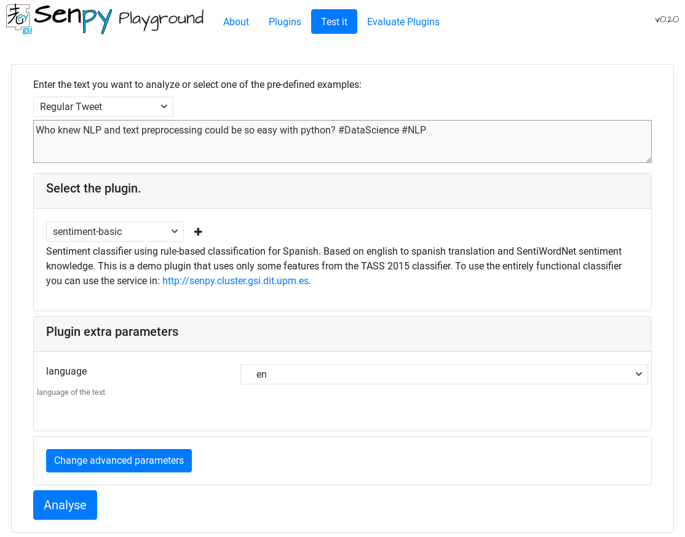

Demo
----

There is a demo available on http://senpy.gsi.upm.es/, where you can test a live instance of Senpy, with several open source plugins.
You can use the playground (a web interface) or make HTTP requests to the service API.

The source code and description of the plugins used in the demo are available here: https://github.com/gsi-upm/senpy-plugins-community/.
