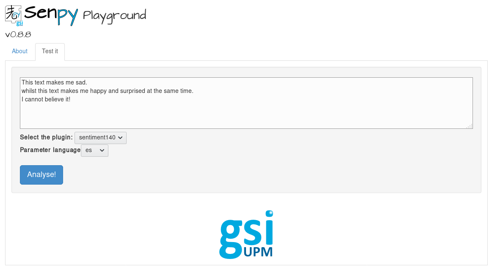

Server
======

The senpy server is launched via the `senpy` command:

.. code:: text

    usage: senpy [-h] [--level logging_level] [--debug] [--default-plugins]
                [--host HOST] [--port PORT] [--plugins-folder PLUGINS_FOLDER]
                [--only-install]

    Run a Senpy server

    optional arguments:
    -h, --help            show this help message and exit
    --level logging_level, -l logging_level
                            Logging level
    --debug, -d           Run the application in debug mode
    --default-plugins     Load the default plugins
    --host HOST           Use 0.0.0.0 to accept requests from any host.
    --port PORT, -p PORT  Port to listen on.
    --plugins-folder PLUGINS_FOLDER, -f PLUGINS_FOLDER
                            Where to look for plugins.
    --only-install, -i    Do not run a server, only install plugin dependencies

When launched, the server will recursively look for plugins in the specified plugins folder (the current working directory by default).
For every plugin found, it will download its dependencies, and try to activate it.
The default server includes a playground and an endpoint with all plugins found.

Let's run senpy with the default plugins:

.. code:: bash

    senpy -f . --default-plugins

Now go to `http://localhost:5000 <http://localhost:5000>`_, you should be greeted by the senpy playground:

The playground is a user-friendly way to test your plugins, but you can always use the service directly:  `http://localhost:5000/api?input=hello <http://localhost:5000/api?input=hello>`_.

By default, senpy will listen only on the `127.0.0.1` address.
That means you can only access the API from your (or localhost).
You can listen on a different address using the `--host` flag (e.g., 0.0.0.0).
The default port is 5000.
You can change it with the `--port` flag. 

For instance, to accept connections on port 6000 on any interface:

.. code:: bash

    senpy --host 0.0.0.0 --port 6000

For more options, see the `--help` page.
